# 单周期CPU设计与实现报告

## 一、 实验目的

(1) 掌握单周期CPU数据通路图的构成、原理及其设计方法；

(2) 掌握单周期CPU的实现方法，代码实现方法；

(3) 认识和掌握指令与CPU的关系；

(4) 掌握测试单周期CPU的方法。

 

二、 实验内容

设计一个单周期CPU，该CPU至少能实现以下指令功能操作。指令与格式如下：

###  算术运算指令

#### (1)add  rd , rs, rt  

| 000000 | rs(5位) | rt(5位) | rd(5位) | 00000 100000 |
| ------ | ------- | ------- | ------- | ------------ |

功能：

```
GPR[rd] ← GPR[rs] + GPR[rt]
```


####   (2)sub  rd , rs , rt

| 000000 | rs(5位) | rt(5位) | rd(5位) | 00000 100010 |
| ------ | ------- | ------- | ------- | ------------ |

功能：

```
GPR[rd] ← GPR[rs] - GPR[rt]
```


#### (3)addiu  rt , rs ,immediate 

| 001001 | rs(5位) | rt(5位) | immediate(16位) |
| ------ | ------- | ------- | --------------- |

功能：

```
GPR[rt] ← GPR[rs] + sign_extend(immediate)；
```

 immediate做符号扩展再参加“与”运算。

 

###  逻辑运算指令

#### (4)andi  rt , rs ,immediate 

| 001100 | rs(5位) | rt(5位) | immediate(16位) |
| ------ | ------- | ------- | --------------- |

功能：

```
GPR[rt] ← GPR[rs] and zero_extend(immediate)；
```

immediate做0扩展再参加“与”运算。

#### (5)and  rd , rs , rt

| 000000 | rs(5位) | rt(5位) | rd(5位) | 00000 100100 |
| ------ | ------- | ------- | ------- | ------------ |

功能:

```
GPR[rd] ← GPR[rs] and GPR[rt]。
```


#### (6)ori  rt , rs ,immediate 

| 001101 | rs(5位) | rt(5位) | immediate(16位) |
| ------ | ------- | ------- | --------------- |

功能：

```
GPR[rt] ← GPR[rs] or zero_extend(immediate)。
```


#### (7)or  rd , rs , rt

| 000000 | rs(5位) | rt(5位) | rd(5位) | 00000 100101 |
| ------ | ------- | ------- | ------- | ------------ |

功能：

```
GPR[rd] ← GPR[rs] or GPR[rt]。
```

 

### 移位指令

#### (8)sll  rd, rt,sa 

| 000000 | 00000 | rt(5位) | rd(5位) | sa(5位) | 000000 |
| ------ | ----- | ------- | ------- | ------- | ------ |

功能：

```
GPR[rd] ← GPR[rt] << sa。
```

### 比较指令

#### (9) slti  rt, rs,immediate  带符号数

| 001010 | rs(5位) | rt(5位) | immediate(16位) |
| ------ | ------- | ------- | --------------- |

功能

```
if GPR[rs] < sign_extend(immediate) GPR[rt] =1 else GPR[rt] = 0。
```


 

###  存储器读写指令

#### (10)sw  rt , offset (rs) 写存储器

| 101011 | rs(5位) | rt(5位) | offset(16位) |
| ------ | ------- | ------- | ------------ |

功能：

```
memory[GPR[base] + sign_extend(offset)] ← GPR[rt]。
```


#### (11)  lw  rt , offset (rs) 读存储器

| 100011 | rs(5位) | rt(5位) | offset (16位) |
| ------ | ------- | ------- | ------------- |

功能：

```
GPR[rt] ← memory[GPR[base] + sign_extend(offset)]
```


 

###  分支指令

####   (12)beq  rs,rt, offset

| 000100 | rs(5位) | rt(5位) | offset (16位) |
| ------ | ------- | ------- | ------------- |

功能：

```
if(GPR[rs] = GPR[rt]) pc←pc + 4 + sign_extend(offset)<<2  
else pc ←pc + 4
```


特别说明：offset是从PC+4地址开始和转移到的指令之间指令条数。offset符号扩展之后左移2位再相加。为什么要左移2位？由于跳转到的指令地址肯定是4的倍数(每条指令占4个字节)，最低两位是“00”，因此将offset放进指令码中的时候，是右移了2位的，也就是以上说的“指令之间指令条数”。

####   (13)bne  rs,rt, offset

| 000101 | rs(5位) | rt(5位) | offset (16位) |
| ------ | ------- | ------- | ------------- |

功能：

```
if(GPR[rs] != GPR[rt]) 
	pc←pc + 4 + sign_extend(offset) <<2  
else 
	pc ←pc + 4
```


####   (14)bltz  rs, offset

| 000110 | rs(5位) | 00000 | offset (16位) |
| ------ | ------- | ----- | ------------- |

功能：


```
if(GPR[rs] ≤ 0) 
	pc←pc + 4 + sign_extend (offset) <<2  
else 
	pc ←pc + 4
```


 

### 跳转指令

#### (15)j  addr   

| 000010 | addr(26位) |
| ------ | ---------- |

功能：

```
PC ← {PC[31:28],addr,2’b0}
```

，无条件跳转。

说明：由于MIPS32的指令代码长度占4个字节，所以指令地址二进制数最低2位均为0，将指令地址放进指令代码中时，可省掉！这样，除了最高6位操作码外，还有26位可用于存放地址，事实上，可存放28位地址，剩下最高4位由pc+4最高4位拼接上。

 

### 停机指令

#### (16)halt 

| 111111 | 00000000000000000000000000(26位) |
| ------ | -------------------------------- |

功能：停机；不改变PC的值，PC保持不变。

 

 

## 三、实验原理

单周期CPU指的是一条指令的执行在一个时钟周期内完成，然后开始下一条指令的执行，即一条指令用一个时钟周期完成。电平从低到高变化的瞬间称为时钟上升沿，两个相邻时钟上升沿之间的时间间隔称为一个时钟周期。时钟周期一般也称振荡周期(如果晶振的输出没有经过分频就直接作为CPU的工作时钟，则时钟周期就等于振荡周期。若振荡周期经二分频后形成时钟脉冲信号作为CPU的工作时钟，这样，时钟周期就是振荡周期的两倍。)

  CPU在处理指令时，一般需要经过以下几个步骤：

  (1) 取指令(IF)：根据程序计数器PC中的指令地址，从存储器中取出一条指令，同时，PC根据指令字长度自动递增产生下一条指令所需要的指令地址，但遇到“地址转移”指令时，则控制器把“转移地址”送入PC，当然得到的“地址”需要做些变换才送入PC。

  (2) 指令译码(ID)：对取指令操作中得到的指令进行分析并译码，确定这条指令需要完成的操作，从而产生相应的操作控制信号，用于驱动执行状态中的各种操作。

  (3) 指令执行(EXE)：根据指令译码得到的操作控制信号，具体地执行指令动作，然后转移到结果写回状态。

  (4) 存储器访问(MEM)：所有需要访问存储器的操作都将在这个步骤中执行，该步骤给出存储器的数据地址，把数据写入到存储器中数据地址所指定的存储单元或者从存储器中得到数据地址单元中的数据。

  (5) 结果写回(WB)：指令执行的结果或者访问存储器中得到的数据写回相应的目的寄存器中。

  单周期CPU，是在一个时钟周期内完成这五个阶段的处理。


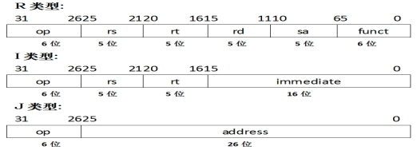


其中，

op：为操作码；

rs：只读。为第1个源操作数寄存器，寄存器地址(编号)是00000~11111，00~1F；

rt：可读可写。为第2个源操作数寄存器，或目的操作数寄存器，寄存器地址(同上)；

rd：只写。为目的操作数寄存器，寄存器地址(同上)；

sa：为位移量(shift amt)，移位指令用于指定移多少位；

funct：为功能码，在寄存器类型指令中(R类型)用来指定指令的功能与操作码配合使用；

immediate：为16位立即数，用作无符号的逻辑操作数、有符号的算术操作数、数据加载(Laod)数据保存(Store)指令的数据地址字节偏移量和分支指令中相对程序计数器(PC)的有符号偏移量；

  address：为地址。

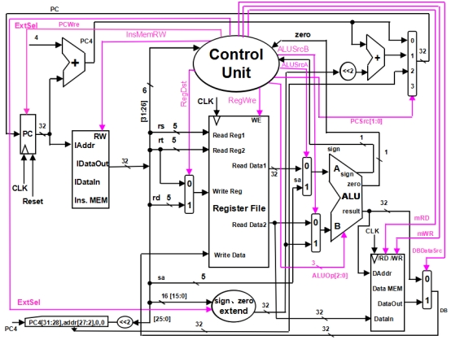

图2  单周期CPU数据通路和控制线路图

 

图2是一个简单的基本上能够在单周期CPU上完成所要求设计的指令功能的数据通路和必要的控制线路图。其中指令和数据各存储在不同存储器中，即有指令存储器和数据存储器。访问存储器时，先给出内存地址，然后由读或写信号控制操作。对于寄存器组，先给出寄存器地址，读操作时不需要时钟信号，输出端就直接输出相应数据；而在写操作时，在 WE使能信号为1时，在时钟边沿触发将数据写入寄存器。图中控制信号作用如表1所示，表2是ALU运算功能表。

表1 控制信号的作用

| 控制信号名  | 状态“0”                                                      | 状态“1”                                                      |
| ----------- | ------------------------------------------------------------ | ------------------------------------------------------------ |
| Reset       | 初始化PC为0                                                  | PC接收新地址                                                 |
| PCWre       | PC不更改，相关指令：halt                                     | PC更改，相关指令：除指令halt外                               |
| ALUSrcA     | 来自寄存器堆data1输出，相关指令：add、sub、addiu、or、and、andi、ori、slti、beq、bne、blez、sw、lw | 来自移位数sa，同时，进行(zero-extend)sa，即 {{27{1'b0}},sa}，相关指令：sll |
| ALUSrcB     | 来自寄存器堆data2输出，相关指令：add、sub、or、and、beq、bne、blez | 来自sign或zero扩展的立即数，相关指令：addi、andi、ori、slti、sw、lw |
| DBDataSrc   | 来自ALU运算结果的输出，相关指令：add、addiu、sub、ori、or、and、andi、slti、sll | 来自数据存储器(Data MEM)的输出，相关指令：lw                 |
| RegWre      | 无写寄存器组寄存器，相关指令：beq、bne、blez、sw、halt       | 寄存器组写使能，相关指令：add、addiu、sub、ori、or、and、andi、slti、sll、lw |
| InsMemRW    | 写指令存储器                                                 | 读指令存储器(Ins. Data)                                      |
| mRD         | 输出高阻态                                                   | 读数据存储器，相关指令：lw                                   |
| mWR         | 无操作                                                       | 写数据存储器，相关指令：sw                                   |
| RegDst      | 写寄存器组寄存器的地址，来自rt字段，相关指令：addiu、andi、ori、slti、lw | 写寄存器组寄存器的地址，来自rd字段，相关指令：add、sub、and、or、sll |
| ExtSel      | (zero-extend)immediate(0扩展)，相关指令：addiu、andi、ori    | (sign-extend)immediate(符号扩展)，相关指令：slti、sw、lw、beq、bne、blez |
| PCSrc[1..0] | 00：pc<－pc+4，相关指令：add、addiu、sub、or、ori、and、andi、slti、sll、sw、lw、beq(zero=0)、bne(zero=1)、blez(sign=0&&zero=0)；01：pc<－pc+4+(sign-extend)immediate，相关指令：beq(zero=1)、bne(zero=0)、blez(sign=1\|\|zero=1)；10：pc<－{(pc+4)[31:28],addr[27:2],2'b00}，相关指令：j；11：未用 |                                                              |
| ALUOp[2..0] | ALU 8种运算功能选择(000-111)，看功能表                       |                                                              |

相关部件及引脚说明：

Instruction Memory：指令存储器，

 Iaddr，指令存储器地址输入端口

 IDataIn，指令存储器数据输入端口(指令代码输入端口)

 IDataOut，指令存储器数据输出端口(指令代码输出端口)

 RW，指令存储器读写控制信号，为0写，为1读

Data Memory：数据存储器，

 Daddr，数据存储器地址输入端口

 DataIn，数据存储器数据输入端口

 DataOut，数据存储器数据输出端口

 RD，数据存储器读控制信号，为0读

 WR，数据存储器写控制信号，为0写

Register File：寄存器组

 Read Reg1，rs寄存器地址输入端口

 Read Reg2，rt寄存器地址输入端口

 Write Reg，将数据写入的寄存器端口，其地址来源rt或rd字段

 Write Data，写入寄存器的数据输入端口

 Read Data1，rs寄存器数据输出端口

 Read Data2，rt寄存器数据输出端口

 WE，写使能信号，为1时，在时钟边沿触发写入

ALU：  算术逻辑单元

 result，ALU运算结果

 zero，运算结果标志，结果为0，则zero=1；否则zero=0

 sign，运算结果标志，结果最高位为0，则sign=0，正数；否则，sign=1，负数

 

表2 ALU运算功能表    

| ALUOp[2..0] | 功能                                                         | 描述             |
| ----------- | ------------------------------------------------------------ | ---------------- |
| 000         | Y = A + B                                                    | 加               |
| 001         | Y = A – B                                                    | 减               |
| 010         | Y = B<<A                                                     | B左移A位         |
| 011         | Y = A ∨ B                                                    | 或               |
| 100         | Y = A ∧ B                                                    | 与               |
| 101         | Y=(A<B)?1: 0                                                 | 比较A与B不带符号 |
| 110         | Y=(((rega<regb) && (rega[31] == regb[31] )) \|\|( ( rega[31] ==1 && regb[31] == 0))) ? 1:0 | 比较A与B带符号   |
| 111         | Y = A Å B                                                    | 异或             |

 

需要说明的是以上数据通路图是根据要实现的指令功能的要求画出来的，同时，还必须确定ALU的运算功能(当然，以上指令没有完全用到提供的ALU所有功能，但至少必须能实现以上指令功能操作)。从数据通路图上可以看出控制单元部分需要产生各种控制信号，当然，也有些信号必须要传送给控制单元。从指令功能要求和数据通路图的关系得出以上表1，这样，从表1可以看出各控制信号与相应指令之间的相互关系，根据这种关系就可以得出控制信号与指令之间的关系表(留给学生完成)，再根据关系表可以写出各控制信号的逻辑表达式，这样控制单元部分就可实现了。

指令执行的结果总是在时钟下降沿保存到寄存器和存储器中，PC的改变是在时钟上升沿进行的，这样稳定性较好。另外，值得注意的问题，设计时，用模块化的思想方法设计，关于ALU设计、存储器设计、寄存器组设计等等，也是必须认真考虑的问题。

 

## 四、实验设备

PC机一台，BASYS 3 实验板一块，Xilinx Vivado 开发软件一套。

## 五、实验步骤

### 1.根据要求，设计模块


####  ALU_ctr模块

```verilog
`timescale 1ns / 1ps
//////////////////////////////////////////////////////////////////////////////////
// Company: 
// Engineer: 
// 
// Create Date: 2024/11/22 21:15:31
// Design Name: 
// Module Name: ALU_ctr
// Project Name: 
// Target Devices: 
// Tool Versions: 
// Description: 
// 
// Dependencies: 
// 
// Revision:
// Revision 0.01 - File Created
// Additional Comments:
// 
//////////////////////////////////////////////////////////////////////////////////


module ALU_ctr(
    input [5:0] opcode, 
    input [5:0] func, 
    
//    input zero, sign,
    
    output reg ALUSrcA, ALUSrcB, //DBDataSrc, RegWre,InsMemRW, mRD, mWR, RegDst, ExtSel, 
    
//    output reg [1: 0] PCSrc,
    
    output reg [3: 0] ALUop

    );
    always @(*)begin 
//        PCSrc=2'b00;
        case(opcode)
            6'b000000: //ALU计算 
            begin
                case(func)
                6'b100000: //加法add
                begin 
                    {ALUSrcA, ALUSrcB}=2'b00; 
//                    PCSrc=2'b00;
                    ALUop=4'b0000; 
//                    WDSel=2'b00; 
                end
                6'b100010: //减法sub
                begin 
                    {ALUSrcA, ALUSrcB}=2'b00; 
//                    PCSrc=2'b00;
                    ALUop=4'b0001; 
//                    WDSel=2'b00; 
                end
                6'b100100: //与and
                begin 
                    {ALUSrcA, ALUSrcB}=2'b00; 
//                    PCSrc=2'b00;
                    ALUop=4'b0100; 
//                    WDSel=2'b00; 
                end
                6'b100101: //或or
                begin 
                    {ALUSrcA, ALUSrcB}=2'b00; 
//                    PCSrc=2'b00;
                    ALUop=4'b0011;
//                    WDSel=2'b00; 
                end
                6'b000000: //左移sll
                begin 
                    {ALUSrcA, ALUSrcB}=2'b10; 
//                    PCSrc=2'b00;
                    ALUop=4'b0010;
//                    WDSel=2'b00; 
                end
                default
                begin 
                    {ALUSrcA, ALUSrcB}=2'b00; 
//                    PCSrc=2'b00;
                    ALUop=4'b0100; 
//                    WDSel=2'b00; 
                end
                endcase 
            end
           
           
            6'b001100://andi
            begin
                {ALUSrcA, ALUSrcB}=2'b01; 
//                PCSrc=2'b00;
                ALUop=4'b0100; 
            end
            6'b001101://ori
            begin
                {ALUSrcA, ALUSrcB}=2'b01; 
//                PCSrc=2'b00;
                ALUop=4'b0011; 
            end
            6'b001010://slti
            begin
                {ALUSrcA, ALUSrcB}=2'b01; 
//                PCSrc=2'b00;
                ALUop=4'b0110; 
            end
            6'b001001://addiu
            begin
                {ALUSrcA, ALUSrcB}=2'b01; 
//                PCSrc=2'b00;
                ALUop=4'b0000; 
            end
            6'b000101://bne
            begin
                {ALUSrcA, ALUSrcB}=2'b00; 
                
                ALUop=4'b0001; 
            end
            6'b000100://beq
            begin
                {ALUSrcA, ALUSrcB}=2'b00; 
               
                ALUop=4'b0001; 
            end
            6'b000010://j
            begin
                {ALUSrcA, ALUSrcB}=2'bxx; 
//                PCSrc=2'b10;
                ALUop=4'bxxxx; 
            end
            6'b000110://bltz
            begin
                {ALUSrcA, ALUSrcB}=2'b00; 

                ALUop=4'b0001; 
            end
            6'b101011://sw
            begin
                {ALUSrcA, ALUSrcB}=2'b01; 
//                PCSrc=2'b00;
                ALUop=4'b0000; 
            end
            
            
            6'b100011://lw
            begin
                {ALUSrcA, ALUSrcB}=2'b01; 
//                PCSrc=2'b00;
                ALUop=4'b0000; 
            end
            default:
//            6'b111111://halt
            begin
                {ALUSrcA, ALUSrcB}=2'b00; 
//                PCSrc=2'b00;
                ALUop=4'b0000; 
            end
//            6'b100001:  
//            begin //lh
//                {ALUSrcA, ALUSrcB}=10'b101111001;
//                PCSrc=2'b00;
//                ALUop=4'b0000; 
//                WDSel=2'b01;
//            end

        endcase 
    end
endmodule

```

#### Ctr模块

```verilog
`timescale 1ns / 1ps
//////////////////////////////////////////////////////////////////////////////////
// Company: 
// Engineer: 
// 
// Create Date: 2024/11/15 17:03:51
// Design Name: 
// Module Name: Control_Unit
// Project Name: 
// Target Devices: 
// Tool Versions: 
// Description: 
// 
// Dependencies: 
// 
// Revision:
// Revision 0.01 - File Created
// Additional Comments:
// 
//////////////////////////////////////////////////////////////////////////////////

module Control_Unit(
    input [5:0] opcode, 
    input [5:0] func, 
    
    input zero, sign,
    
    output reg PCWre, DBDataSrc, RegWre,InsMemRW, mRD, mWR, RegDst, ExtSel, 
    
    output reg [1: 0] PCSrc
    
//    output reg [3: 0] //ALUop
    
    
    
//    output reg [1: 0] WDSel 
    );
    initial begin
        PCWre=1'b0;
//        ALUSrcA=1'b0;
//        ALUSrcB=1'b0;
        DBDataSrc=1'b0;
        RegWre=1'b0;
        InsMemRW=1'b0;
        mRD=1'b0;
        mWR=1'b0;
        RegDst=1'b0;
        ExtSel=1'b0;
        
        PCSrc=2'b00;
        
        //ALUop=4'b0000;
    end
    always @(*)begin 
        PCSrc=2'b00;
        case(opcode)
            6'b000000: //ALU计算 
            begin
                case(func)
                6'b100000: //加法add
                begin 
                    {PCWre, DBDataSrc, RegWre, InsMemRW,mRD, mWR, RegDst, ExtSel}=8'b1011x01x; 
                    PCSrc=2'b00;
                    //ALUop=4'b0000; 
//                    WDSel=2'b00; 
                end
                6'b10010: //减法sub
                begin 
                    {PCWre, DBDataSrc, RegWre, InsMemRW,mRD, mWR, RegDst, ExtSel}=8'b1011x01x; 
                    PCSrc=2'b00;
                    //ALUop=4'b0001; 
//                    WDSel=2'b00; 
                end
                6'b100100://与and
                begin
                    {PCWre, DBDataSrc, RegWre, InsMemRW,mRD, mWR, RegDst, ExtSel}=8'b1011x01x; 
                    PCSrc=2'b00;
                    //ALUop=4'b0010; 
//                    WDSel=2'b00; 
                end
                6'b100101: //或or
                begin 
                    {PCWre, DBDataSrc, RegWre, InsMemRW,mRD, mWR, RegDst, ExtSel}=8'b1011x01x; 
                    PCSrc=2'b00;
                    //ALUop=4'b0011; 
//                    WDSel=2'b00; 
                end
                6'b000000: //左移sll
                begin 
                    {PCWre, DBDataSrc, RegWre, InsMemRW,mRD, mWR, RegDst, ExtSel}=8'b1011x01x; 
                    PCSrc=2'b00;
                    //ALUop=4'b0100; 
//                    WDSel=2'b00; 
                end
                default
                begin 
                    {PCWre, DBDataSrc, RegWre, InsMemRW,mRD, mWR, RegDst, ExtSel}=8'b1011x01x; 
                    PCSrc=2'b00;
                    //ALUop=4'b0100; 
//                    WDSel=2'b00; 
                end
                endcase 
            end
           
           
            6'b001100://andi
            begin
                {PCWre, DBDataSrc, RegWre, InsMemRW,mRD, mWR, RegDst, ExtSel}=8'b1011x000; 
                PCSrc=2'b00;
                //ALUop=4'b0010; 
            end
            6'b001101://ori
            begin
                {PCWre, DBDataSrc, RegWre, InsMemRW,mRD, mWR, RegDst, ExtSel}=8'b1011x000; 
                PCSrc=2'b00;
                //ALUop=4'b0011; 
            end
            6'b001010://slti
            begin
                {PCWre, DBDataSrc, RegWre, InsMemRW,mRD, mWR, RegDst, ExtSel}=8'b1011x001;
                PCSrc=2'b00;
                //ALUop=4'b0110; 
            end
            6'b001001://addiu
            begin
                {PCWre, DBDataSrc, RegWre, InsMemRW,mRD, mWR, RegDst, ExtSel}=8'b1011x001; 
                PCSrc=2'b00;
                //ALUop=4'b0000; 
            end
            6'b000101://bne
            begin
                {PCWre, DBDataSrc, RegWre, InsMemRW,mRD, mWR, RegDst, ExtSel}=8'b1x01x0x1;
                 
                PCSrc=2'b00;
                if(!zero)
                begin
                    PCSrc=2'b01;
                end
                else
                begin
                    PCSrc=2'b00;
                end
                //ALUop=4'b0001; 
            end
            6'b000100://beq
            begin
                {PCWre, DBDataSrc, RegWre, InsMemRW,mRD, mWR, RegDst, ExtSel}=8'b1x01x0x1; 
                PCSrc=2'b00;
                if(zero)
                begin
                    PCSrc=2'b01;
                end
                else
                begin
                    PCSrc=2'b00;
                end
            end
            6'b000010://j
            begin
                {PCWre, DBDataSrc, RegWre, InsMemRW,mRD, mWR, RegDst, ExtSel}=8'b1x01x0xx; 
                PCSrc=2'b10;
                //ALUop=4'bxxxx; 
            end
            6'b000110://bltz
            begin
                {PCWre, DBDataSrc, RegWre, InsMemRW,mRD, mWR, RegDst, ExtSel}=8'b1x01x0x1;
                PCSrc=2'b00;
                if(sign)
                
                begin
                    PCSrc=2'b01;
                end
                else
                begin
                    PCSrc=2'b00;
                end            

                //ALUop=4'b0001; 
            end
            6'b101011://sw
            begin
                {PCWre, DBDataSrc, RegWre, InsMemRW,mRD, mWR, RegDst, ExtSel}=8'b1x0101x1; 
                PCSrc=2'b00;
                //ALUop=4'b0000; 
            end
            
            
            6'b100011://lw
            begin
                {PCWre, DBDataSrc, RegWre, InsMemRW,mRD, mWR, RegDst, ExtSel}=8'b11111001;
                PCSrc=2'b00;
                //ALUop=4'b0000; 
            end
            default:
//            6'b111111://halt
            begin
                {PCWre, DBDataSrc, RegWre, InsMemRW,mRD, mWR, RegDst, ExtSel}=8'b00000000; 
                PCSrc=2'b00;
                //ALUop=4'b0000; 
            end
//            6'b100001:  
//            begin //lh
//                {PCWre, DBDataSrc, RegWre, InsMemRW,mRD, mWR, RegDst, ExtSel}=8'b101111001;
//                PCSrc=2'b00;
//                //ALUop=4'b0000; 
//                WDSel=2'b01;
//            end

        endcase 
    end
endmodule 

```


##### Ctr模块仿真

```verilog
`timescale 1ns / 1ps
//////////////////////////////////////////////////////////////////////////////////
// Company: 
// Engineer: 
// 
// Create Date: 2024/11/15 20:09:04
// Design Name: 
// Module Name: Ctr_Unit_test
// Project Name: 
// Target Devices: 
// Tool Versions: 
// Description: 
// 
// Dependencies: 
// 
// Revision:
// Revision 0.01 - File Created
// Additional Comments:
// 
//////////////////////////////////////////////////////////////////////////////////


module Ctr_Unit_test();
    reg [5:0] opcode;
    reg [5:0] func;
    
    reg zero, sign;
    
    wire PCWre, ALUSrcA, ALUSrcB, DBDataSrc, RegWre,InsMemRW, mRD, mWR, RegDst, ExtSel;
    
    wire [1: 0] PCSrc;
    
    wire [3: 0] ALUop;
    initial begin
        opcode=6'b000000;
        func=6'b000000;
        zero=0;
        sign=0;
        #50;
        opcode=6'b000001;
        func=6'b000000;
        zero=0;
        sign=0;
        #50;
        opcode=6'b101011;
        func=6'b000000;
        zero=0;
        sign=0;
        #50;
        opcode=6'b111111;
        func=6'b000000;
        zero=0;
        sign=0;
        #50;
    end
    Control_Unit a(
        .opcode(opcode), 
        .func(func), 
        .zero(zero), 
        .sign(sign),
        .PCWre(PCWre), 
        .DBDataSrc(DBDataSrc), 
        .RegWre(RegWre),
        .InsMemRW(InsMemRW), 
        .mRD(mRD),
        .mWR(mWR), 
        .RegDst(RegDst), 
        .ExtSel(ExtSel), 
        .PCSrc(PCSrc)
    );
    ALU_ctr b(
        .opcode(opcode), 
        .func(func), 
        .ALUSrcA(ALUSrcA), 
        .ALUSrcB(ALUSrcB), 
        .ALUop(ALUop)
    );
endmodule

```

##### 仿真结果

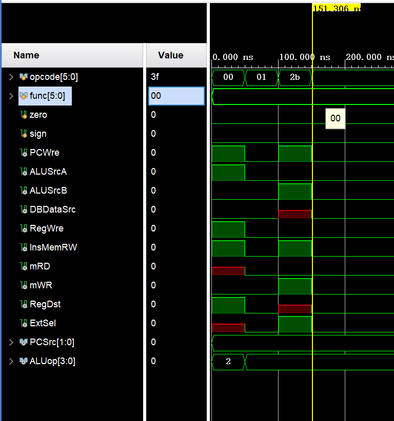

#### Reg模块

```verilog
`timescale 1ns / 1ns//寄存器堆模块
module RegFile(CLK,CLR,W_Reg_Ctr,R_Reg_Addr_A,R_Reg_Addr_B,W_Reg_Addr,W_Reg_Data,R_Reg_Data_A,R_Reg_Data_B);
   

    parameter SIZE = 32;
    reg [SIZE-1:0]Reg_Data[0:31];
    input CLK,CLR,W_Reg_Ctr;
    input [4:0]R_Reg_Addr_A,R_Reg_Addr_B,W_Reg_Addr;
    input [31:0]W_Reg_Data;
    output [31:0]R_Reg_Data_A,R_Reg_Data_B;
    
//    input CLK,CLR,R_ctr,W_ctr;
    
//    input [4:0]Mem_Addr;
//    input [31:0]Data_in;
//    output [SIZE-1:0]Data_out;
//    reg [SIZE-1:0]Data_out;
    integer i;
    initial begin
        for(i=0;i<32;i=i+1) 
                Reg_Data[i]<=32'hxxxx_xxxx;
    end
    always@(posedge CLK or posedge CLR)//时钟信号或清零信号上升沿
    begin
        if(CLR)//清零
        begin:loop
            integer i;
//            R_Reg_Data_A=32'hzzzz_zzzz;
//            R_Reg_Data_B=32'hzzzz_zzzz;
            for(i=0;i<32;i=i+1) 
                Reg_Data[i]<=32'h0000_0000;
        end 
        else if(CLK)
        begin
            if(W_Reg_Ctr)
            begin
                Reg_Data[W_Reg_Addr]<=W_Reg_Data[31:0];
            end
//            else if(!R_ctr && W_ctr)
//            begin
//                Data[Mem_Addr]<=Data_in[31:0];
//                Data_out<=32'hzzzz_zzzz;
//            end
//            else
//            begin
//                Data_out<=32'hzzzz_zzzz;
//            end
            
                
        end
    end   
    assign R_Reg_Data_A=Reg_Data[R_Reg_Addr_A];
    assign R_Reg_Data_B=Reg_Data[R_Reg_Addr_B];    
endmodule

```

##### Reg模块仿真

```verilog
`timescale 1ns / 1ps
//////////////////////////////////////////////////////////////////////////////////
// Company: 
// Engineer: 
// 
// Create Date: 2024/11/17 20:55:31
// Design Name: 
// Module Name: Reg_test
// Project Name: 
// Target Devices: 
// Tool Versions: 
// Description: 
// 
// Dependencies: 
// 
// Revision:
// Revision 0.01 - File Created
// Additional Comments:
// 
//////////////////////////////////////////////////////////////////////////////////


module Reg_test();
    reg CLK;
    reg CLR;
    reg W_Reg_Ctr;
    reg [4:0]R_Reg_Addr_A;
    reg [4:0]R_Reg_Addr_B;
    reg [4:0]W_Reg_Addr;
    reg [31:0]W_Reg_Data;
    wire [31:1]R_Reg_Data_A;
    wire [31:0]R_Reg_Data_B;
    initial begin
        CLK=0;
        CLR=0;
        #50;
        CLR=1;
        #50;
        CLR=0;
        #50;
        CLK=1;
        #50;
        CLK=0;
        W_Reg_Ctr=1'b1;
        R_Reg_Addr_A=5'b00000;
        
        R_Reg_Addr_B=5'b00001;
        W_Reg_Addr=5'b00000;
        
        W_Reg_Data=32'h0000_1234;
        #50;
        CLK=1;
        #50;
        CLK=0;
        W_Reg_Ctr=1'b0;
        R_Reg_Addr_A=5'b00001;
        
        R_Reg_Addr_B=5'b00000;
        W_Reg_Addr=5'b00001;
        
        W_Reg_Data=32'h0000_12dd;
        #50;
        CLK=1;
        #50;
        CLK=0;
        CLR=1;
        #50;
        CLK=1;
        CLR=0;
        #50;
        CLK=0;
        #50;
        CLK=1;
        #50;
        CLK=0;
        #50;
        CLK=1;
        
        
        
    
    end
    

    RegFile regtest(
        .CLK(CLK),
        .CLR(CLR),
        .W_Reg_Ctr(W_Reg_Ctr),
        .R_Reg_Addr_A(R_Reg_Addr_A),
        .R_Reg_Addr_B(R_Reg_Addr_B),
        .W_Reg_Addr(W_Reg_Addr),
        .W_Reg_Data(W_Reg_Data),
        .R_Reg_Data_A(R_Reg_Data_A),
        .R_Reg_Data_B(R_Reg_Data_B)
    );

    
    
endmodule

```

##### 仿真结果

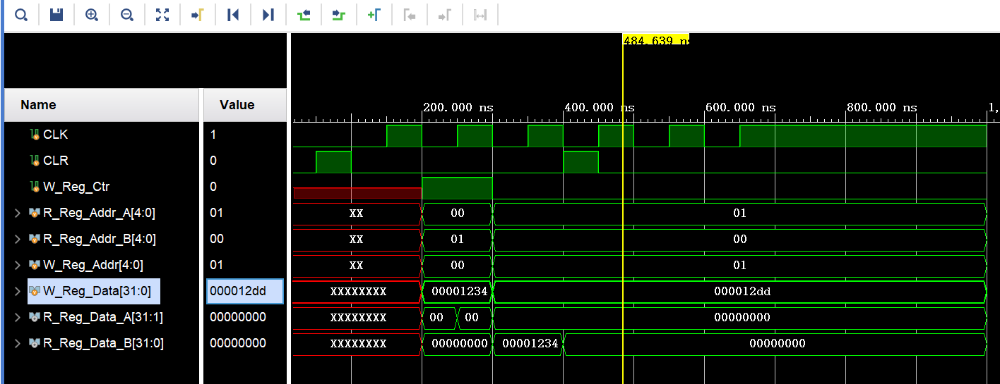


#### ALU模块

```verilog
`timescale 1ns / 1ps
module ALU(OP,A,B,F,ZF,CF,OF,SF,PF);
    parameter SIZE = 32;//运算位数
    input [3:0] OP;//运算操作
    input [SIZE-1:0] A;//左运算数
    input [SIZE-1:0] B;//右运算数
    output [SIZE-1:0] F;//运算结果
    output ZF, //0标志位, 运算结果为0(全零)则置1, 否则置0
            CF, //进借位标志位, 取最高位进位C,加法时C=1则CF=1表示有进位,减法时C=0则CF=1表示有借位
            OF, //溢出标志位，对有符号数运算有意义，溢出则OF=1，否则为0                     
            SF, //符号标志位，与F的最高位相同
            PF; //奇偶标志位，F有奇数个1，则PF=1，否则为0    
    reg [SIZE-1:0] F;
    reg C,ZF,CF,OF,SF,PF;//C为最高位进位
    always@(*)
    begin
        C=0;
        case(OP)
            4'b0000:begin {C,F}=A+B; end //加法
            4'b0001:begin {C,F}=A-B; end //减法
            
            
            4'b0010:begin F=B<<A; end   //将B左移A位
            
            4'b0011:begin F=A|B; end    //按位或
            4'b0100:begin F=A&B; end    //按位与
            4'b0101:begin F=A<B?1:0; end //无符号比较
            4'b0110:begin F=(((A<B) && (A[31] == B[31] )) ||( ( A[31] ==1 && B[31] == 0))) ?1:0; end //有符号比较
            
            4'b0111:begin F=A^B; end //异或
            
            
//            4'b0101:begin F=A^B; end    //按位异或
//            4'b0110:begin F=A<B?1:0; end //按位或非 
//            4'b0111:begin F=A<B; end//A<B则F=1，否则F=0       
        endcase
        ZF = F==0;//F全为0，则ZF=1
        CF = C; //进位借位标志
        OF = A[SIZE-1]^B[SIZE-1]^F[SIZE-1]^C;//溢出标志公式
        SF = F[SIZE-1];//符号标志,取F的最高位
        PF = ~^F;//奇偶标志，F有奇数个1，则F=1；偶数个1，则F=0
    end

endmodule

```

#### Ins_Memory模块

```verilog
`timescale 1ns / 1ps
//////////////////////////////////////////////////////////////////////////////////
// Company: 
// Engineer: 
// 
// Create Date: 2024/11/15 13:16:41
// Design Name: 
// Module Name: Ins_Memory
// Project Name: 
// Target Devices: 
// Tool Versions: 
// Description: 
// 
// Dependencies: 
// 
// Revision:
// Revision 0.01 - File Created
// Additional Comments:
// 
//////////////////////////////////////////////////////////////////////////////////


module Ins_Memory(
    input [31:0]In_Addr,
    input RW,
    input [31:0]Ins_Data_in,
    output reg [31:0]Ins_Data_out
    );
    
    
    reg [7:0]Ins[0:127];
    integer i=0;
    initial begin
    { Ins[0*4+0], Ins[0*4+1], Ins[0*4+2], Ins[0*4+3]}=32'b00100100000000010000000000001000;
    { Ins[1*4+0], Ins[1*4+1], Ins[1*4+2], Ins[1*4+3]}=32'b00110100000000100000000000000010;
    { Ins[2*4+0], Ins[2*4+1], Ins[2*4+2], Ins[2*4+3]}=32'b00000000010000010001100000100000;
    { Ins[3*4+0], Ins[3*4+1], Ins[3*4+2], Ins[3*4+3]}=32'b00000000011000100010100000100010;
    { Ins[4*4+0], Ins[4*4+1], Ins[4*4+2], Ins[4*4+3]}=32'b00000000101000100010000000100100;
    { Ins[5*4+0], Ins[5*4+1], Ins[5*4+2], Ins[5*4+3]}=32'b00000000100000100100000000100101;
    { Ins[6*4+0], Ins[6*4+1], Ins[6*4+2], Ins[6*4+3]}=32'b00000000000010000100000001000000;
    { Ins[7*4+0], Ins[7*4+1], Ins[7*4+2], Ins[7*4+3]}=32'b00010101000000011111111111111110;
    { Ins[8*4+0], Ins[8*4+1], Ins[8*4+2], Ins[8*4+3]}=32'b00101000010001100000000000000100;
    { Ins[9*4+0], Ins[9*4+1], Ins[9*4+2], Ins[9*4+3]}=32'b00101000110001110000000000000000;
    { Ins[10*4+0], Ins[10*4+1], Ins[10*4+2], Ins[10*4+3]}=32'b00100100111001110000000000001000;
    { Ins[11*4+0], Ins[11*4+1], Ins[11*4+2], Ins[11*4+3]}=32'b00010000111000011111111111111110;
    { Ins[12*4+0], Ins[12*4+1], Ins[12*4+2], Ins[12*4+3]}=32'b10101100001000100000000000000100;
    { Ins[13*4+0], Ins[13*4+1], Ins[13*4+2], Ins[13*4+3]}=32'b10001100001010010000000000000100;
    { Ins[14*4+0], Ins[14*4+1], Ins[14*4+2], Ins[14*4+3]}=32'b00100100000010101111111111111110;
    { Ins[15*4+0], Ins[15*4+1], Ins[15*4+2], Ins[15*4+3]}=32'b00100101010010100000000000000001;
    { Ins[16*4+0], Ins[16*4+1], Ins[16*4+2], Ins[16*4+3]}=32'b00011001010000001111111111111110;
    { Ins[17*4+0], Ins[17*4+1], Ins[17*4+2], Ins[17*4+3]}=32'b00110000010010110000000000000010;
    { Ins[18*4+0], Ins[18*4+1], Ins[18*4+2], Ins[18*4+3]}=32'b00001000000000000000000000010011;
    { Ins[19*4+0], Ins[19*4+1], Ins[19*4+2], Ins[19*4+3]}=32'b00000000100000100100000000100101;
    { Ins[20*4+0], Ins[20*4+1], Ins[20*4+2], Ins[20*4+3]}=32'b11111100000000000000000000000000;
    


    end
    
    
    
    
    always@(*)
    begin
        if(RW) //无操作
        begin
            Ins_Data_out<={Ins[In_Addr],Ins[In_Addr+1],Ins[In_Addr+2],Ins[In_Addr+3]};
//            Ins[In_Addr]=Data_in;
//            for(i=0; i<32; i=i+2)
//                Ins[i]<=32'hffff_fffa;
//                Ins[i+1]<=32'hffff_ff11;
        end 
        else 
        begin
            
            Ins_Data_out<={Ins[In_Addr],Ins[In_Addr+1],Ins[In_Addr+2],Ins[In_Addr+3]};
        end
             
                
    end        
endmodule

```

##### InsMemory测试仿真

```verilog
`timescale 1ns / 1ps
//////////////////////////////////////////////////////////////////////////////////
// Company: 
// Engineer: 
// 
// Create Date: 2024/11/15 13:37:24
// Design Name: 
// Module Name: Ins_test
// Project Name: 
// Target Devices: 
// Tool Versions: 
// Description: 
// 
// Dependencies: 
// 
// Revision:
// Revision 0.01 - File Created
// Additional Comments:
// 
//////////////////////////////////////////////////////////////////////////////////


module Ins_test();
    reg [31:0]In_Addr;
    reg [31:0]Ins_Data_in;
    wire [31:0]Ins_Data_out;
    reg RW;
    initial begin
        RW=0;
        In_Addr=0;
//        Data_in=32'h0000_0023
        #50
        RW=0;
        In_Addr=32'h0000_0000;
        #50;
        In_Addr=32'h0000_0004;
        #50;
        In_Addr=32'h0000_0008;
        #50;
        In_Addr=32'h0000_000c;
        #50;
        
    end
    
    Ins_Memory a(
        .In_Addr(In_Addr),
        .RW(RW),
        .Ins_Data_in(Ins_Data_in),
        .Ins_Data_out(Ins_Data_out)
    );
endmodule

```

##### 仿真结果

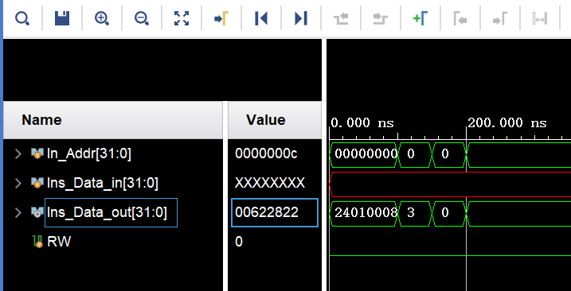


####  Memory模块

```verilog
`timescale 1ns / 1ns
//////////////////////////////////////////////////////////////////////////////////
// Company: 
// Engineer: 
// 
// Create Date: 2024/11/14 23:11:31
// Design Name: 
// Module Name: Memory
// Project Name: 
// Target Devices: 
// Tool Versions: 
// Description: 
// 
// Dependencies: 
// 
// Revision:
// Revision 0.01 - File Created
// Additional Comments:
// 
//////////////////////////////////////////////////////////////////////////////////


module Memory(Mem_Addr,Data_in,Data_out,CLK,CLR,R_ctr,W_ctr);
    parameter SIZE = 32;
    reg [SIZE/4-1:0]Data[0:127];
    
    input CLK,CLR,R_ctr,W_ctr;
    
    input [SIZE-1:0]Mem_Addr;
    input [SIZE-1:0]Data_in;
    output [SIZE-1:0]Data_out;
//    reg [SIZE-1:0]Data_out;
    
    always@(posedge CLK or posedge CLR)//时钟信号或清零信号上升沿
    begin
        if(CLR)//清零
        begin:loop
            integer i;
//            Data_out=32'hzzzz_zzzz;
            for(i=0;i<127;i=i+4) 
                {Data[i],Data[i+1],Data[i+2],Data[i+3]}<=32'h0000_0000;
//                R_ctr=1'b0;
//                W_ctr=1'b0;
        end 
        else if(CLK)
        begin
            if(R_ctr && !W_ctr)
            begin
//                Data_out<=Data[Mem_Addr];
            end
            else if(!R_ctr && W_ctr)
            begin
                {Data[Mem_Addr*4],Data[Mem_Addr*4+1],Data[Mem_Addr*4+2],Data[Mem_Addr*4+3]}<=Data_in[31:0];
//                Data_out<=32'hzzzz_zzzz;
            end
            else
            begin
//                Data_out<=32'hzzzz_zzzz;
            end
            
                
        end
             
                
    end   
    assign Data_out={Data[Mem_Addr*4],Data[Mem_Addr*4+1],Data[Mem_Addr*4+2],Data[Mem_Addr*4+3]};
endmodule

```

##### Memory模块仿真

```verilog
`timescale  1ns/1ns
//////////////////////////////////////////////////////////////////////////////////
// Company: 
// Engineer: 
// 
// Create Date: 2024/11/15 00:02:31
// Design Name: 
// Module Name: Memory_test
// Project Name: 
// Target Devices: 
// Tool Versions: 
// Description: 
// 
// Dependencies: 
// 
// Revision:
// Revision 0.01 - File Created
// Additional Comments:
// 
//////////////////////////////////////////////////////////////////////////////////


module Memory_test(

    );
    parameter SIZE = 32;
    reg [SIZE:1]Mem_Addr;
    reg [SIZE:1]Data_in;
    wire [SIZE:1]Data_out;
    reg CLK,CLR,R_ctr,W_ctr;
    
    
    initial begin
        CLK=0;
        CLR=1;
        R_ctr=0;
        W_ctr=0;
        Data_in=32'h0000_0000;
        Mem_Addr=32'h0000_0000;
        
        
        #50;
        CLR=0;
        CLK=1;
        Mem_Addr=32'h0000_0000;
        W_ctr=1;
        Data_in=32'hffff_1234;
        
        
        
        #50;
        CLK=0;
        #50;
        CLK=1;
        Mem_Addr=32'h0000_0001;
        W_ctr=1;
        Data_in=32'hffff_0000;
        
        #50
        CLK=0;
        #50;
        CLK=1;
        W_ctr=0;
        R_ctr=1;
        Mem_Addr=32'h0000_0000;
        #50;
        CLK=0;
        #50;
        
        
        CLK=1;
        Mem_Addr=32'h0000_0001;
        #50;
        CLK=0;
    end
//    wire [SIZE:1]F;
    Memory a(
        .Mem_Addr(Mem_Addr),
        .Data_in(Data_in),
        .Data_out(Data_out),
        .CLK(CLK),
        .CLR(CLR),
        .R_ctr(R_ctr),
        .W_ctr(W_ctr)
    );
    
endmodule

```

##### 仿真结果

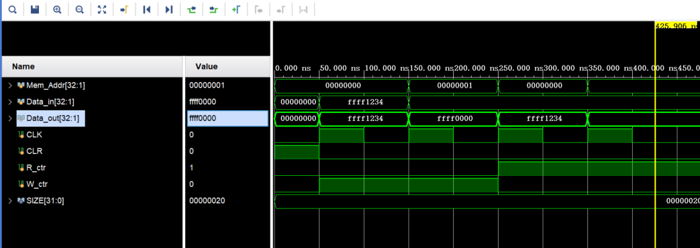


####  Extend_Unit模块

```verilog
`timescale 1ns / 1ps
//////////////////////////////////////////////////////////////////////////////////
// Company: 
// Engineer: 
// 
// Create Date: 2024/11/14 22:13:33
// Design Name: 
// Module Name: Extend_Unit
// Project Name: 
// Target Devices: 
// Tool Versions: 
// Description: 
// 
// Dependencies: 
// 
// Revision:
// Revision 0.01 - File Created
// Additional Comments:
// 
//////////////////////////////////////////////////////////////////////////////////


module Extend_Unit(in,Ex_Op,out);
    parameter SIZE = 32;
    
    input [15:0]in;
    input Ex_Op;
    
    output [SIZE-1:0] out;
    reg [SIZE-1:0]out;
    always@(*)
        begin
        if(Ex_Op)
            out={(Ex_Op&&in[15])?16'hffff:16'h0000,in};
        else
            out={16'h0000,in};
    end 
    
endmodule

```

##### Extend_Unit模块仿真

```verilog
`timescale 1ns / 1ps
//////////////////////////////////////////////////////////////////////////////////
// Company: 
// Engineer: 
// 
// Create Date: 2024/11/14 22:36:51
// Design Name: 
// Module Name: Extend_test
// Project Name: 
// Target Devices: 
// Tool Versions: 
// Description: 
// 
// Dependencies: 
// 
// Revision:
// Revision 0.01 - File Created
// Additional Comments:
// 
//////////////////////////////////////////////////////////////////////////////////


module Extend_test();
//    reg 
    parameter SIZE = 32;
    reg [16:1]in;
    wire [32:1]out;
//    reg [SIZE:1]input_B;
    reg Op;
    initial begin
        in=16'hffff;
        Op=1'b0;
        #50;
        Op=1'b1;
        #50;
        in=16'h0f32;
    end
//    wire [SIZE:1]F;
    Extend_Unit a(
        .in(in),
        .Op(Op),
        .out(out)
    );
endmodule

```


##### 仿真结果


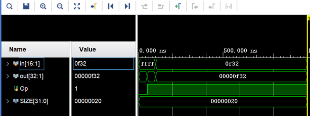


#### PC模块

```verilog
`timescale 1ns / 1ps
//////////////////////////////////////////////////////////////////////////////////
// Company: 
// Engineer: 
// 
// Create Date: 2024/11/15 12:38:07
// Design Name: 
// Module Name: PC
// Project Name: 
// Target Devices: 
// Tool Versions: 
// Description: 
// 
// Dependencies: 
// 
// Revision:
// Revision 0.01 - File Created
// Additional Comments:
// 
//////////////////////////////////////////////////////////////////////////////////


module PC(
    input W_PC,
    input CLK,
    input CLR,
    input [31:0] new_Addr,
    output reg [31:0] PC_Addr
    );
    always@(negedge CLK or posedge CLR)
    begin
        if(CLR)
            PC_Addr=32'h0000_0000;
        else if(!CLK)
        begin
            PC_Addr=W_PC?new_Addr[31:0]:PC_Addr[31:0];
        end
    end
endmodule

```

##### PC模块仿真

```verilog
`timescale 1ns / 1ps
//////////////////////////////////////////////////////////////////////////////////
// Company: 
// Engineer: 
// 
// Create Date: 2024/11/15 12:48:30
// Design Name: 
// Module Name: PC_test
// Project Name: 
// Target Devices: 
// Tool Versions: 
// Description: 
// 
// Dependencies: 
// 
// Revision:
// Revision 0.01 - File Created
// Additional Comments:
// 
//////////////////////////////////////////////////////////////////////////////////


module PC_test();
    reg W_PC,CLK,CLR;
    reg [31:0]new_Addr;
    wire [31:0]PC_Addr;
    initial begin
        CLR=1;
        CLK=0;
        W_PC=0;
        #50;
        W_PC=1;
        new_Addr=32'h0000_0100;
        CLK=1;
        CLR=0;
        #50;
        CLK=0;
        #50;
        W_PC=1;
        new_Addr=32'h0000_1000;
        CLK=1;
        #50;
        CLK=0;
        
        #50;
        W_PC=0;
        new_Addr=32'h0000_1100;
        CLK=1;
        #50;
        CLK=0;
        #50;
        CLK=1;
    end
    PC a(
    .W_PC(W_PC),
    .CLK(CLK),
    .CLR(CLR),
    .new_Addr(new_Addr),
    .PC_Addr(PC_Addr)
    );
endmodule

```


##### 仿真结果

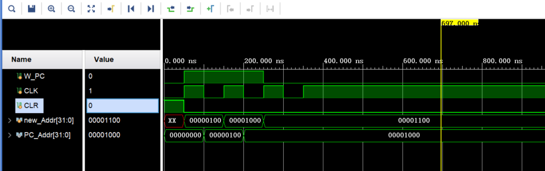

#### jump计算模块

```verilog
`timescale 1ns / 1ps
//////////////////////////////////////////////////////////////////////////////////
// Company: 
// Engineer: 
// 
// Create Date: 2024/11/16 19:42:41
// Design Name: 
// Module Name: jump_PC
// Project Name: 
// Target Devices: 
// Tool Versions: 
// Description: 
// 
// Dependencies: 
// 
// Revision:
// Revision 0.01 - File Created
// Additional Comments:
// 
//////////////////////////////////////////////////////////////////////////////////


module jump_PC(
    input [3:0]PC_head,
    input [25:0]Jump_where,
    output reg [31:0]PC_Jump
    );
//    [31:0]PC_Jump;
    always@(*)
    begin
        PC_Jump={PC_head,Jump_where,2'b00};
    end
endmodule

```


#### PCbeq计算模块

```verilog
`timescale 1ns / 1ps
//////////////////////////////////////////////////////////////////////////////////
// Company: 
// Engineer: 
// 
// Create Date: 2024/11/16 20:02:30
// Design Name: 
// Module Name: PC_beq
// Project Name: 
// Target Devices: 
// Tool Versions: 
// Description: 
// 
// Dependencies: 
// 
// Revision:
// Revision 0.01 - File Created
// Additional Comments:
// 
//////////////////////////////////////////////////////////////////////////////////


module PC_beq(input [31:0]PC_now,input [31:0]PC_add,output reg[31:0]PC_next);
    always@(*)
    begin
        PC_next=PC_now+4+PC_add*4;
    end
endmodule

```

#### Multiplexer模块


#### 3选1，32位

```verilog
`timescale 1ns / 1ps
//////////////////////////////////////////////////////////////////////////////////
// Company: 
// Engineer: 
// 
// Create Date: 2024/11/14 21:36:46
// Design Name: 
// Module Name: Multiplexer
// Project Name: 
// Target Devices: 
// Tool Versions: 
// Description: 
// 
// Dependencies: 
// 
// Revision:
// Revision 0.01 - File Created
// Additional Comments:
// 
//////////////////////////////////////////////////////////////////////////////////


module Mul_3to1(input_A,input_B,input_C,output_Data,Mul_Op);
    parameter SIZE = 32;
    
    input [SIZE-1:0]input_A;
    input [SIZE-1:0]input_B;
    input [SIZE-1:0]input_C;
    input [1:0]Mul_Op;
    output [SIZE-1:0] output_Data;
    reg [SIZE-1:0]output_Data;
    always@(*)
        begin
        case (Mul_Op)
        2'b00:
            output_Data=input_A+4;
        2'b01:
            output_Data=input_B;
        2'b10:
            output_Data=input_C;
        endcase
//        if(!Mul_Op)
//            output_Data=input_A;
//        else
//            output_Data=input_B;
    end 
endmodule

```

#### 2选1，32位

```verilog
`timescale 1ns / 1ps
//////////////////////////////////////////////////////////////////////////////////
// Company: 
// Engineer: 
// 
// Create Date: 2024/11/14 21:36:46
// Design Name: 
// Module Name: Multiplexer
// Project Name: 
// Target Devices: 
// Tool Versions: 
// Description: 
// 
// Dependencies: 
// 
// Revision:
// Revision 0.01 - File Created
// Additional Comments:
// 
//////////////////////////////////////////////////////////////////////////////////


module Multiplexer(input_A,input_B,output_Data,Mul_Op);
    parameter SIZE = 32;
    
    input [SIZE-1:0]input_A;
    input [SIZE-1:0]input_B;
    input Mul_Op;
    output [SIZE-1:0] output_Data;
    reg [SIZE-1:0]output_Data;
    always@(*)
        begin
        if(!Mul_Op)
            output_Data=input_A;
        else
            output_Data=input_B;
    end 
endmodule

```

#### 2选1，5位

```verilog
`timescale 1ns / 1ps
//////////////////////////////////////////////////////////////////////////////////
// Company: 
// Engineer: 
// 
// Create Date: 2024/11/14 21:36:46
// Design Name: 
// Module Name: Multiplexer
// Project Name: 
// Target Devices: 
// Tool Versions: 
// Description: 
// 
// Dependencies: 
// 
// Revision:
// Revision 0.01 - File Created
// Additional Comments:
// 
//////////////////////////////////////////////////////////////////////////////////


module Multiplexer_5(input_A,input_B,output_Data,Mul_Op);
    parameter SIZE = 5;
    
    input [SIZE-1:0]input_A;
    input [SIZE-1:0]input_B;
    input Mul_Op;
    output [SIZE-1:0] output_Data;
    reg [SIZE-1:0]output_Data;
    always@(*)
        begin
        if(!Mul_Op)
            output_Data=input_A;
        else
            output_Data=input_B;
    end 
endmodule

```


### 2设计模块连接

模块连接如下

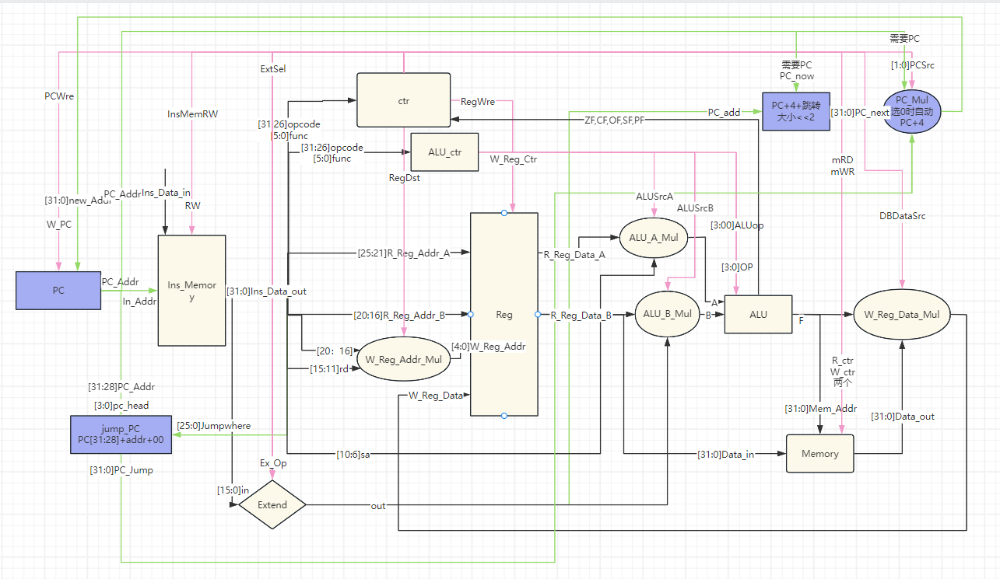

### 3完成CPU顶层模块

```verilog
`timescale 1ns / 1ps
//////////////////////////////////////////////////////////////////////////////////
// Company: 
// Engineer: 
// 
// Create Date: 2024/11/16 09:57:17
// Design Name: 
// Module Name: CPU_top
// Project Name: 
// Target Devices: 
// Tool Versions: 
// Description: 
// 
// Dependencies: 
// 
// Revision:
// Revision 0.01 - File Created
// Additional Comments:
// 
//////////////////////////////////////////////////////////////////////////////////


module CPU_top(
    input CLK,
    input CLR,
    output wire [31:0]PC_now,
    output wire [31:0]new_Addr,
    output wire [4:0]R_Reg_Addr_A,
    output wire [4:0]R_Reg_Addr_B,
    output wire [31:0]R_Reg_Data_A,
    output wire [31:0]R_Reg_Data_B,
    output wire [31:0] DB,
    
    output wire [31:0] F
    
);
//Reg,ALU,InsMemory,Memory,Extend,PC,Mul*5,ctr,jump_PC, PC_beq


//    RegFile(CLK,CLR,W_Reg_Ctr,R_Reg_Addr_A,R_Reg_Addr_B,W_Reg_Addr,W_Reg_Data,R_Reg_Data_A,R_Reg_Data_B);
    wire W_Reg_Ctr;
//    wire [4:0]R_Reg_Addr_A;
//    wire [4:0]R_Reg_Addr_B;
    wire [4:0]W_Reg_Addr;
    wire [31:0]W_Reg_Data;
//    wire [31:0]R_Reg_Data_A;
//    wire [31:0]R_Reg_Data_B;
    
//    ALU(OP,A,B,F,ZF,CF,OF,SF,PF);
    wire [3:0]OP;
    wire [31:0]A;
    wire [31:0]B;
//    wire [31:0]F;
    wire ZF;
    wire CF;
    wire OF;
    wire SF;
    wire PF;
    
//    Ins_Memory
    wire [31:0]In_Addr;
    wire RW;
    wire [31:0]Ins_Data_in;
    wire [31:0]Ins_Data_out;
    
//    Memory
//    Addr,Data_in,Data_out,CLK,CLR,R_ctr,W_ctr
    wire [31:0]Mem_Addr;
    wire [31:0]Data_in;
    wire [31:0]Data_out;
    wire R_ctr;
    wire W_ctr;
    
//    Extend_Unit
//    (in,Op,out);
    wire [15:0]in;
    wire Ex_Op;
    wire [31:0]out;    
    

    
//    PC(W_PC,CLK, CLR, [31:0] new_Addr,[31:0] PC_Addr);
    wire W_PC;
//    wire CLK;
//    wire CLR;
//    wire [31:0]new_Addr;
    wire [31:0]PC_Addr;
    
//    Multiplexer(input_A,input_B,output_Data,Mul_Op);
//    5个选择器?
//    wire input_A;
//    wire input_B;
//    wire output_Data;
//    wire Mul_Op;
    
        wire [4:0]W_Reg_Addr_Mul_input_A;
        wire [4:0]W_Reg_Addr_Mul_input_B;
        wire [4:0]W_Reg_Addr_Mul_output_Data;
        wire W_Reg_Addr_Mul_Mul_Op;
        
        wire [31:0]ALU_A_Mul_input_A;
        wire [31:0]ALU_A_Mul_input_B;
        wire [31:0]ALU_A_Mul_output_Data;
        wire ALU_A_Mul_Mul_Op;
        
        wire [31:0]ALU_B_Mul_input_A;
        wire [31:0]ALU_B_Mul_input_B;
        wire [31:0]ALU_B_Mul_output_Data;
        wire ALU_B_Mul_Mul_Op;
        
        wire [31:0]W_Reg_Data_Mul_input_A;
        wire [31:0]W_Reg_Data_Mul_input_B;
        wire [31:0]W_Reg_Data_Mul_output_Data;
        wire W_Reg_Data_Mul_Mul_Op;

        wire [31:0]PC_Mul_input_A;
        wire [31:0]PC_Mul_input_B;
        wire [31:0]PC_Mul_input_C;
        wire [31:0]PC_Mul_output_Data;
        wire [1:0]PC_Mul_Mul_Op;
        

//    Control_Unit Ctr
    wire [5:0]opcode;
    wire [5:0]func;
    wire zero, sign;
    wire PCWre, ALUSrcA, ALUSrcB, DBDataSrc, RegWre,InsMemRW, mRD, mWR, RegDst, ExtSel;
    wire [1:0]PCSrc;
    wire [3:0]ALUop;
    
//    jump_PC(
    wire [3:0]PC_head;
    wire [25:0]Jump_where;
    wire [31:0]PC_Jump;
    
    
//    PC_beq(input [31:0]PC_now,input [31:0]PC_add,output reg[31:0]PC_next);
//    wire [31:0]PC_now;
    wire [31:0]PC_add;
    wire [31:0]PC_next;
//    assign Ctr输入的赋值
    assign opcode=Ins_Data_out[31:26];
    assign func=Ins_Data_out[5:0];
    assign zero=ZF;
    assign sign=SF;
//    assign ZF,CF,OF,SF,PF 


//    assign Reg OK
    assign W_Reg_Ctr=RegWre;
    assign R_Reg_Addr_A=Ins_Data_out[25:21];
    assign R_Reg_Addr_B=Ins_Data_out[20:16];
    assign W_Reg_Addr=W_Reg_Addr_Mul_output_Data[4:0];
    assign W_Reg_Data=W_Reg_Data_Mul_output_Data[31:0];
    assign DB=W_Reg_Data_Mul_output_Data[31:0];
//    assign ALU OK
    assign A=ALU_A_Mul_output_Data[31:0];
    assign B=ALU_B_Mul_output_Data[31:0];
    assign OP = ALUop[3:0];
    
    
//    assign Mul*5
//    都是32位需要修改
    assign W_Reg_Addr_Mul_input_A=Ins_Data_out[20:16];
    assign W_Reg_Addr_Mul_input_B=Ins_Data_out[15:11];
    assign W_Reg_Addr_Mul_Mul_Op=RegDst;
    
    assign W_Reg_Data_Mul_input_A=F[31:0];
    assign W_Reg_Data_Mul_input_B=Data_out[31:0];
    assign W_Reg_Data_Mul_Mul_Op=DBDataSrc;
//    assign DB=DBDataSrc
        
    assign ALU_A_Mul_input_A=R_Reg_Data_A[31:0];
    assign ALU_A_Mul_input_B={27'b000000000000000000000000000,Ins_Data_out[10:6]};
    assign ALU_A_Mul_Mul_Op=ALUSrcA;
    
    assign ALU_B_Mul_input_A=R_Reg_Data_B[31:0];
    assign ALU_B_Mul_input_B=out[31:0];
    assign ALU_B_Mul_Mul_Op=ALUSrcB;
    
    
    assign PC_Mul_input_A=PC_Addr[31:0];
    assign PC_Mul_input_B=PC_next[31:0];
    assign PC_Mul_input_C=PC_Jump[31:0];
    assign PC_Mul_Mul_Op=PCSrc[1:0];
    
    
//    Ins_Memory
    assign In_Addr=PC_Addr[31:0];
    assign RW=InsMemRW;
//    assign Ins_Data_in;//没有？

//    Memory
//    Addr,Data_in,Data_out,CLK,CLR,R_ctr,W_ctr
    assign Mem_Addr=F[31:0];
    assign Data_in=R_Reg_Data_B[31:0];
    assign R_ctr=mRD;
    assign W_ctr=mWR;

//    Extend_Unit
//    (in,Op,out);
    assign in=Ins_Data_out[15:0];
    assign Ex_Op=ExtSel;  

//    PC
    assign W_PC=PCWre;
    assign new_Addr=PC_Mul_output_Data[31:0];


//    jump_PC
    assign PC_head=PC_Addr[31:28];
    assign Jump_where=Ins_Data_out[25:0];

//    PC_beq(input PC_now,input PC_add,output regPC_next);
    assign PC_now=PC_Addr[31:0];
    assign PC_add=out[31:0];
    ALU_ctr ALU_ctr(
        .opcode(opcode),
        .func(func),
        .ALUSrcA(ALUSrcA),
        .ALUSrcB(ALUSrcB),
        .ALUop(ALUop)
        
    );
    Control_Unit Ctr_Unit(
        .opcode(opcode),
        .func(func),
        .zero(zero),
        .sign(sign),
        .PCWre(PCWre),
        
        .DBDataSrc(DBDataSrc),
        .RegWre(RegWre),
        .InsMemRW(InsMemRW),
        .mRD(mRD),
        .mWR(mWR),
        .RegDst(RegDst),
        .ExtSel(ExtSel),
        .PCSrc(PCSrc)
    );

    RegFile Reg(        //输入        
        .CLK(CLK),//时钟信号        
        .CLR(CLR),//清零信号        
        .W_Reg_Ctr(W_Reg_Ctr),//写入控制        
        .R_Reg_Addr_A(R_Reg_Addr_A),//A端口读地址       
        .R_Reg_Addr_B(R_Reg_Addr_B),//B端口读地址        
        .W_Reg_Addr(W_Reg_Addr),//写入地址       
        .W_Reg_Data(W_Reg_Data),//写入数据, 由外部或ALU输入                
         //输出        
        .R_Reg_Data_A(R_Reg_Data_A),//A端口读出数据        
        .R_Reg_Data_B(R_Reg_Data_B)//B端口读出数据    
    );              //实例化ALU模块    
     
    ALU ALU(    //输入        
        .OP(OP),//运算符                
        .A(A),//从寄存器读A操作数       
        .B(B),//从寄存器读B操作数       
        //输出 
        .F(F),//ALU_F作为中间变量暂存运算结果，与Input_Data选择输入寄存器                      
        .ZF(ZF),//零标志       
        .CF(CF),//进借位标志(只对无符号数运算有意义)        
        .OF(OF),//溢出标志(只对有符号数运算有意义)        
        .SF(SF),//符号标志(只对有符号数运算有意义)       
        .PF(PF)//奇偶标志    
    );
    Ins_Memory Ins(
        .In_Addr(In_Addr),
        .RW(RW),
        .Ins_Data_in(Ins_Data_in),
        .Ins_Data_out(Ins_Data_out)
    );
    Memory Mem(
        .Mem_Addr(Mem_Addr),
        .Data_in(Data_in),
        .Data_out(Data_out),
        .CLK(CLK),
        .CLR(CLR),
        .R_ctr(R_ctr),
        .W_ctr(W_ctr)
    );
    Extend_Unit Ex(
        .in(in),
        .Ex_Op(Ex_Op),
        .out(out)
    );
    PC PC(
        .W_PC(W_PC),
        .CLK(CLK),
        .CLR(CLR),
        .new_Addr(new_Addr),
        .PC_Addr(PC_Addr)
    );
    jump_PC j(
        .PC_head(PC_head),
        .Jump_where(Jump_where),
        .PC_Jump(PC_Jump)
    );
    PC_beq PC_b(
        .PC_now(PC_now),
        .PC_add(PC_add),
        .PC_next(PC_next)
    );
//5个mul
    Mul_3to1 PC_Mul(
        .input_A( PC_Mul_input_A ),
        .input_B( PC_Mul_input_B ),
        .input_C( PC_Mul_input_C ),
        .output_Data( PC_Mul_output_Data ),
        .Mul_Op( PC_Mul_Mul_Op )
    );
    
    Multiplexer ALU_A_Mul(
        .input_A(ALU_A_Mul_input_A ),
        .input_B( ALU_A_Mul_input_B ),
        .output_Data( ALU_A_Mul_output_Data ),
        .Mul_Op( ALU_A_Mul_Mul_Op )
    );
    Multiplexer ALU_B_Mul(
        .input_A( ALU_B_Mul_input_A ),
        .input_B( ALU_B_Mul_input_B ),
        .output_Data( ALU_B_Mul_output_Data ),
        .Mul_Op( ALU_B_Mul_Mul_Op )
    );
    Multiplexer W_Reg_Data_Mul(
        .input_A( W_Reg_Data_Mul_input_A ),
        .input_B( W_Reg_Data_Mul_input_B ),
        .output_Data( W_Reg_Data_Mul_output_Data ),
        .Mul_Op( W_Reg_Data_Mul_Mul_Op )
    );
    Multiplexer_5 W_Reg_Addr_Mul(
        .input_A( W_Reg_Addr_Mul_input_A ),
        .input_B( W_Reg_Addr_Mul_input_B ),
        .output_Data( W_Reg_Addr_Mul_output_Data ),
        .Mul_Op( W_Reg_Addr_Mul_Mul_Op )
    );

    

endmodule

```

### 4编写Basys3板输出相关模块

#### LED显示模块

```verilog

`timescale 1ns / 1ps
//////////////////////////////////////////////////////////////////////////////////
// Company: 
// Engineer: 
// 
// Create Date: 2024/11/20 21:01:45
// Design Name: 
// Module Name: LED_trans
// Project Name: 
// Target Devices: 
// Tool Versions: 
// Description: 
// 
// Dependencies: 
// 
// Revision:
// Revision 0.01 - File Created
// Additional Comments:
// 
//////////////////////////////////////////////////////////////////////////////////


module LED_trans(
    input [3:0] num, 
    output reg [7:0] dispcode

    );
    always @( num ) begin
        case (num)
            4'b0000 : dispcode = 8'b1100_0000; //0；'0'-亮灯，'1'-熄灯
            4'b0001 : dispcode = 8'b1111_1001; //1
            4'b0010 : dispcode = 8'b1010_0100; //2
            4'b0011 : dispcode = 8'b1011_0000;  //3
            4'b0100 : dispcode = 8'b1001_1001; //4
            4'b0101 : dispcode = 8'b1001_0010; //5
            4'b0110 : dispcode = 8'b1000_0010; //6
            4'b0111 : dispcode = 8'b1101_1000; //7
            4'b1000 : dispcode = 8'b1000_0000; //8
            4'b1001 : dispcode = 8'b1001_0000; //9
            4'b1010 : dispcode = 8'b1000_1000; //A
            4'b1011 : dispcode = 8'b1000_0011; //b
            4'b1100 : dispcode = 8'b1100_0110; //C
            4'b1101 : dispcode = 8'b1010_0001; //d
            4'b1110 : dispcode = 8'b1000_0110; //E
            4'b1111 : dispcode = 8'b1000_1110; //F
            default : dispcode = 8'b0000_0000; //不亮
        endcase
    end
endmodule

```

#### 消抖器

```verilog
`timescale 1ns / 1ps
//////////////////////////////////////////////////////////////////////////////////
// Company: 
// Engineer: 
// 
// Create Date: 2024/11/21 22:24:28
// Design Name: 
// Module Name: Key
// Project Name: 
// Target Devices: 
// Tool Versions: 
// Description: 
// 
// Dependencies: 
// 
// Revision:
// Revision 0.01 - File Created
// Additional Comments:
// 
//////////////////////////////////////////////////////////////////////////////////


//module Key(
//    input button_CLK,
//    input CLK,
//    output reg Button
//);
//    reg [21:0]low;
//    reg [21:0]high; 
    
//    always@(posedge CLK)
//    begin
    
//        low<=button_CLK?1'b0:low+1;
//        high<=!button_CLK?1'b0:high+1;
        
//        if(high==5000)
//        begin
//            Button<=1'b1;
//        end
//        if(low==5000)
//        begin
//            Button<=1'b0;
//        end
        
//    end
    

module Key(
    input button,
    input CLK,

    output  CPU_CLK
);

reg previous;
reg current;
wire button_remain_low;
reg [20:0] counter;
reg debounced_previous;
reg debounced_current;

assign button_remain_low = previous & (~current); //无变化
assign CPU_CLK = debounced_previous & (~debounced_current);

always @ (posedge CLK) begin
    current <= button;
    previous <= current;
end

always @ (posedge CLK) begin
    if(button_remain_low)
        counter <= 21'h0;
    else
        counter <= counter + 1;
end

always @ (posedge CLK) begin
    if(counter == 2000000) 
        debounced_current <= current;
    debounced_previous <= debounced_current;
end

endmodule

//endmodule

```

#### Basys3的综合模块

```verilog
`timescale 1ns / 1ps
//////////////////////////////////////////////////////////////////////////////////
// Company: 
// Engineer: 
// 
// Create Date: 2024/11/20 21:04:49
// Design Name: 
// Module Name: base_top
// Project Name: 
// Target Devices: 
// Tool Versions: 
// Description: 
// 
// Dependencies: 
// 
// Revision:
// Revision 0.01 - File Created
// Additional Comments:
// 
//////////////////////////////////////////////////////////////////////////////////


module base_top(
    input CLK,
    input CLR,
    input button_CLK,
    input [1:0]SW,
    
    output reg[11:0] display_out
    );
    wire CPU_CLK;
    wire [31:0] PC_now;
    wire [31:0] new_Addr;
    wire [4:0] R_Reg_Addr_A;
    wire [4:0] R_Reg_Addr_B;
    wire [31:0] R_Reg_Data_A;
    wire [31:0] R_Reg_Data_B;
    wire [31:0]DB;
    wire [31:0] F;
    reg [3:0]num;
    wire [7:0]dispcode;
//    wire [7:0]display1,display2,display3,display4;
//    reg [3:0]num1,num2,num3,num4;
//    Key k(
//        .button_CLK(button_CLK),
//        .CLK(CLK),
//        .Button(CPU_CLK)
//    );
    Key k(
        .button(button_CLK),
        .CLK(CLK),

        .CPU_CLK(CPU_CLK)
    );
    CPU_top CPU(
//        .CLK(button_CLK),
        .CLK(CPU_CLK),
        .CLR(CLR),
        .PC_now(PC_now),
        .new_Addr(new_Addr),
        .R_Reg_Addr_A(R_Reg_Addr_A),
        .R_Reg_Addr_B(R_Reg_Addr_B),
        .R_Reg_Data_A(R_Reg_Data_A),
        .R_Reg_Data_B(R_Reg_Data_B),
        .DB(DB),
        .F(F)

    );
    LED_trans L(
        .num(num),
        .dispcode(dispcode)
    );
//
    reg [19:0] count = 0;
    reg [2:0] sel = 0;
    parameter T1MS = 100000;
    always@(negedge CLK)begin
        if(SW == 2'b00)
        begin
            case(sel)
                0: num <= PC_now[7:4];
                1: num <= PC_now[3:0];
                2: num <= new_Addr[7:4];
                3: num <= new_Addr[3:0];
                default: num <= PC_now[3:0];
            endcase
        end
        else if(SW == 2'b01) 
        begin
            case(sel)
                3: num <= {3'b000,R_Reg_Addr_A[4]};
                2: num <= R_Reg_Addr_A[3:0];
                1: num <= R_Reg_Data_A[7:4];
                0: num <= R_Reg_Data_A[3:0];
                default: num <= R_Reg_Data_A[3:0];

            endcase
        end
        else if(SW == 2'b10) 
        begin
            case(sel)
               
                3: num <= {3'b000,R_Reg_Addr_B[4]};
                2: num <= R_Reg_Addr_B[3:0];
                1: num <= R_Reg_Data_B[7:4];
                0: num <= R_Reg_Data_B[3:0];
                default: num <= R_Reg_Data_B[3:0];

            endcase
        end
        else if(SW == 2'b11) 
        begin
            case(sel)
                
                1: num <= DB[7:4];
                0: num <= DB[3:0];
                3: num <= F[7:4];
                2: num <= F[3:0];
                default: num <= F[3:0];

            endcase
        end
        
    
    end
    
    always @(posedge CLK) begin
        if(SW == 2'b00)
        begin
            case(sel)
                0: display_out <={4'b0111,dispcode[7:0]};
                1: display_out <={4'b1011,dispcode[7:0]};
                2: display_out <={4'b1101,dispcode[7:0]};
                3: display_out <={4'b1110,dispcode[7:0]};
                default: display_out <={4'b1111,dispcode[7:0]};
            endcase
        end
        else if(SW == 2'b01) 
        begin
            case(sel)
                0: display_out <={4'b1110,dispcode[7:0]};
                1: display_out <={4'b1101,dispcode[7:0]};
                2: display_out <={4'b1011,dispcode[7:0]};
                3: display_out <={4'b0111,dispcode[7:0]};
                default: display_out <={4'b1111,dispcode[7:0]};
            endcase
        end
        else if(SW == 2'b10) 
        begin
            case(sel)
                0: display_out <={4'b1110,dispcode[7:0]};
                1: display_out <={4'b1101,dispcode[7:0]};
                2: display_out <={4'b1011,dispcode[7:0]};
                3: display_out <={4'b0111,dispcode[7:0]};
                default: display_out <={4'b1111,dispcode[7:0]};
            endcase
        end
        else if(SW == 2'b11) 
        begin
            case(sel)
                0: display_out <={4'b1110,dispcode[7:0]};
                1: display_out <={4'b1101,dispcode[7:0]};
                2: display_out <={4'b1011,dispcode[7:0]};
                3: display_out <={4'b0111,dispcode[7:0]};
                default: display_out <={4'b1111,dispcode[7:0]};
            endcase
        end
        end


    always @(posedge CLK) begin
        count <= count + 1;
        if(count == T1MS) begin
            count <= 0;
            sel <= sel + 1;
            if(sel == 4)
                sel <= 0;
        end
    end


    
    
endmodule


```


### 5仿真检查

##### CPU顶层仿真如下

```verilog
`timescale 1ns / 1ns
//////////////////////////////////////////////////////////////////////////////////
// Company: 
// Engineer: 
// 
// Create Date: 2024/11/16 22:15:34
// Design Name: 
// Module Name: CPU_test
// Project Name: 
// Target Devices: 
// Tool Versions: 
// Description: 
// 
// Dependencies: 
// 
// Revision:
// Revision 0.01 - File Created
// Additional Comments:
// 
//////////////////////////////////////////////////////////////////////////////////


module CPU_test();
    reg CLK;
    reg CLR;
    wire [31:0]PC_now;		
	wire [4:0] R_Reg_Addr_A;
     wire [4:0] R_Reg_Addr_B;
     wire [31:0] R_Reg_Data_A; 
     wire [31:0] R_Reg_Data_B; 
     wire [31:0] new_Addr;
     wire [31:0] F;
     wire [31:0] DB;

    initial begin
        CLK=0;
        CLR=0;
        #10;
        
        CLK=0;
        CLR=1;
        
        #10;
        CLK=0;
        CLR=0;
        
        
        #10;
        CLK=1;
        #10;
        CLK=0;
        #10;
        CLK=1;
        #10;
        CLK=0;
        #10;
        CLK=1;
        #10;
        CLK=0;
        #10;
        CLK=1;
        #10;
        CLK=0;
        #10;
        CLK=1;
        #10;
        CLK=0;
        #10;
        CLK=1;
        #10;
        CLK=0;
        #10;
        CLK=1;
        #10;
        CLK=0;
        #10;
        CLK=1;
        #10;
        CLK=0;
        #10;
        CLK=1;
        #10;
        CLK=0;
        #10;
        CLK=1;
        #10;
        CLK=0;
        #10;
        CLK=1;
        #10;
        CLK=0;
        #10;
        CLK=1;
        #10;
        CLK=0;
        #10;
        CLK=1;
        #10;
        CLK=0;
        #10;
        CLK=1;
        #10;
        CLK=0;
        #10;
        CLK=1;
        #10;
        CLK=0;
        #10;
        CLK=1;
        #10;
        CLK=0;
        #10;
        CLK=1;
        #10;
        CLK=0;
        #10;
        CLK=1;
        #10;
        CLK=0;
        #10;
        CLK=1;
        #10;
        CLK=0;
        #10;
        CLK=1;
        #10;
        CLK=0;
        #10;
        CLK=1;
        #10;
        CLK=0;
        #10;
        CLK=1;
        #10;
        CLK=0;
        #10;
        CLK=1;
        #10;
        CLK=0;
        #10;
        CLK=1;
        #10;
        CLK=0;
        #10;
        CLK=1;
        #10;
        CLK=0;
        #10;
        CLK=1;
        #10;
        CLK=0;
        #10;
        CLK=1;
        #10;
        CLK=0;
        #10;
        CLK=1;
        #10;
        CLK=0;
        #10;
        CLK=1;
        #10;
        CLK=0;
        
    end
    CPU_top CPU_single(    
        .CLK(CLK),
        .CLR(CLR),
        .new_Addr(new_Addr),
        .PC_now(PC_now),
        .R_Reg_Addr_A(R_Reg_Addr_A),
        .R_Reg_Addr_B(R_Reg_Addr_B),
        .R_Reg_Data_A(R_Reg_Data_A),
        .R_Reg_Data_B(R_Reg_Data_B),
        .DB(DB),
        .F(F)

    );
    
endmodule

```


##### 仿真结果

详细解释在烧板展示部分

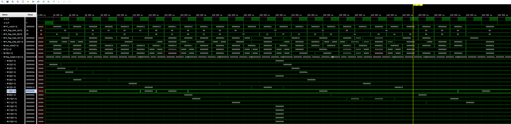

##### Base板的顶层仿真如下

```verilog
`timescale 1ns / 1ps
//////////////////////////////////////////////////////////////////////////////////
// Company: 
// Engineer: 
// 
// Create Date: 2024/11/21 08:53:14
// Design Name: 
// Module Name: base_test
// Project Name: 
// Target Devices: 
// Tool Versions: 
// Description: 
// 
// Dependencies: 
// 
// Revision:
// Revision 0.01 - File Created
// Additional Comments:
// 
//////////////////////////////////////////////////////////////////////////////////


module base_test(

    );
    
     reg CLK;
     reg CLR;
     reg button_CLK;
    
    reg [1:0]status;
     
     wire [11:0]display_out;
     initial begin
     CLK=0;
     CLR=0;
     button_CLK=0;
     
     #50;
     CLR=1;
     CLK=1;
     status=2'b00;
     #50;
     CLR=0;
     CLK=0;
     #50;
     CLK=1;
     button_CLK=1;
     #50;
     CLK=0;
     button_CLK=0;
     #50;
     CLK=1;
     button_CLK=1;
     #50;
     CLK=0;
     button_CLK=0;
     #50;
     CLK=1;
     button_CLK=1;
     #50;
     CLK=0;
     button_CLK=0;
     #50;
     CLK=1;
     button_CLK=1;
     #50;
     CLK=0;
     button_CLK=0;
     #50;
     CLK=1;
     button_CLK=1;
     #50;
     CLK=0;
     button_CLK=0;
     #50;
     CLK=1;
     button_CLK=1;
     #50;
     CLK=0;
     button_CLK=0;
     #50;
     CLK=1;
     button_CLK=1;
     #50;
     CLK=0;
     button_CLK=0;
     #50;
     CLK=1;
     button_CLK=1;
     #50;
     CLK=0;
     button_CLK=0;
     #50;
     CLK=1;
     button_CLK=1;
     #50;
     CLK=0;
     button_CLK=0;
     #50;
     CLK=1;
     button_CLK=1;
     #50;
     CLK=0;
     button_CLK=0;
     #50;
     CLK=1;
     button_CLK=1;
     #50;
     CLK=0;
     button_CLK=0;
     #50;
     CLK=1;
     button_CLK=1;
     #50;
     CLK=0;
     button_CLK=0;
     #50;
     CLK=1;
     button_CLK=1;
     #50;
     CLK=0;
     button_CLK=0;
     #50;
     CLK=1;
     button_CLK=1;
     #50;
     CLK=0;
     button_CLK=0;
     #50;
     CLK=1;
     button_CLK=1;
     #50;
     CLK=0;
     button_CLK=0;
     end
      
     base_top base(
        .CLK(CLK),
        .CLR(CLR),
        .button_CLK(button_CLK),
        .SW(status),
        .display_out(display_out)
//        .dis_addr(dis_addr)
        
     
     );
endmodule

```


##### 仿真结果

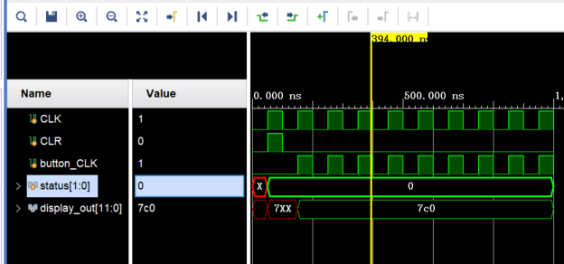

### 6烧板

编写约束文件，然后烧板

```vivado
set_property PACKAGE_PIN T17 [get_ports button_CLK]
set_property PACKAGE_PIN V17 [get_ports CLR]
set_property IOSTANDARD LVCMOS33 [get_ports button_CLK]
set_property IOSTANDARD LVCMOS33 [get_ports CLR]
set_property PACKAGE_PIN R2 [get_ports {SW[1]}]
set_property PACKAGE_PIN T1 [get_ports {SW[0]}]
set_property IOSTANDARD LVCMOS33 [get_ports {SW[1]}]
set_property IOSTANDARD LVCMOS33 [get_ports {SW[0]}]
set_property PACKAGE_PIN W5 [get_ports CLK]
set_property IOSTANDARD LVCMOS33 [get_ports CLK]
set_property PACKAGE_PIN W4 [get_ports {display_out[11]}]
set_property PACKAGE_PIN V4 [get_ports {display_out[10]}]
set_property PACKAGE_PIN U4 [get_ports {display_out[9]}]
set_property PACKAGE_PIN U2 [get_ports {display_out[8]}]
set_property PACKAGE_PIN V7 [get_ports {display_out[7]}]
set_property PACKAGE_PIN W7 [get_ports {display_out[0]}]
set_property PACKAGE_PIN W6 [get_ports {display_out[1]}]
set_property PACKAGE_PIN U8 [get_ports {display_out[2]}]
set_property PACKAGE_PIN V8 [get_ports {display_out[3]}]
set_property PACKAGE_PIN U5 [get_ports {display_out[4]}]
set_property PACKAGE_PIN V5 [get_ports {display_out[5]}]
set_property PACKAGE_PIN U7 [get_ports {display_out[6]}]
set_property IOSTANDARD LVCMOS33 [get_ports {display_out[11]}]
set_property IOSTANDARD LVCMOS33 [get_ports {display_out[10]}]
set_property IOSTANDARD LVCMOS33 [get_ports {display_out[9]}]
set_property IOSTANDARD LVCMOS33 [get_ports {display_out[8]}]
set_property IOSTANDARD LVCMOS33 [get_ports {display_out[7]}]
set_property IOSTANDARD LVCMOS33 [get_ports {display_out[6]}]
set_property IOSTANDARD LVCMOS33 [get_ports {display_out[5]}]
set_property IOSTANDARD LVCMOS33 [get_ports {display_out[4]}]
set_property IOSTANDARD LVCMOS33 [get_ports {display_out[3]}]
set_property IOSTANDARD LVCMOS33 [get_ports {display_out[1]}]
set_property IOSTANDARD LVCMOS33 [get_ports {display_out[2]}]
set_property IOSTANDARD LVCMOS33 [get_ports {display_out[0]}]
set_property CLOCK_DEDICATED_ROUTE FALSE [get_nets button_CLK_IBUF]
#set_property CLOCK_DEDICATED_ROUTE FALSE [get_nets reset_IBUF] 
```


## 六、结果

### 执行了以下的程序：

| 地址       | 汇编程序                | op     | rs    | rt    | imm   | imm      | imm    |
| ---------- | ----------------------- | ------ | ----- | ----- | ----- | -------- | ------ |
|            |                         | op(6)  | rs(5) | rt(5) | rd(5) | reserved | func   |
| 0x00000000 | addiu \$1,\$0,8         | 001001 | 00000 | 00001 | 00000 | 00000    | 001000 |
| 0x00000004 | ori \$2,\$0,2           | 001101 | 00000 | 00010 | 00000 | 00000    | 000010 |
| 0x00000008 | add \$3,\$2,\$1         | 000000 | 00010 | 00001 | 00011 | 00000    | 100000 |
| 0x0000000C | sub \$5,\$3,\$2         | 000000 | 00011 | 00010 | 00101 | 00000    | 100010 |
| 0x00000010 | and \$4,\$5,\$2         | 000000 | 00101 | 00010 | 00100 | 00000    | 100100 |
| 0x00000014 | or \$8,\$4,\$2          | 000000 | 00100 | 00010 | 01000 | 00000    | 100101 |
| 0x00000018 | sll \$8,\$8,1           | 000000 | 00000 | 01000 | 01000 | 00001    | 000000 |
| 0x0000001C | bne \$8,\$1,-2 (≠,转18) | 000101 | 01000 | 00001 | 11111 | 11111    | 111110 |
| 0x00000020 | slti \$6,\$2,4          | 001010 | 00010 | 00110 | 00000 | 00000    | 000100 |
| 0x00000024 | slti \$7,\$6,0          | 001010 | 00110 | 00111 | 00000 | 00000    | 000000 |
| 0x00000028 | addiu \$7,\$7,8         | 001001 | 00111 | 00111 | 00000 | 00000    | 001000 |
| 0x0000002C | beq \$7,\$1,-2 (=,转28) | 000100 | 00111 | 00001 | 11111 | 11111    | 111110 |
| 0x00000030 | sw \$2,4(\$1)           | 101011 | 00001 | 00010 | 00000 | 00000    | 000100 |
| 0x00000034 | lw \$9,4(\$1)           | 100011 | 00001 | 01001 | 00000 | 00000    | 000100 |
| 0x00000038 | addiu \$10,\$0,-2       | 001001 | 00000 | 01010 | 11111 | 11111    | 111110 |
| 0x0000003C | addiu \$10,\$10,1       | 001001 | 01010 | 01010 | 00000 | 00000    | 000001 |
| 0x00000040 | blez \$10,-2(≤0,转3C)   | 000110 | 01010 | 00000 | 11111 | 11111    | 111110 |
| 0x00000044 | andi \$11,\$2,2         | 001100 | 00010 | 01011 | 00000 | 00000    | 000010 |
| 0x00000048 | j 0x0000004C            | 000010 | 00000 | 00000 | 00000 | 00000    | 010011 |
| 0x0000004C | or \$8,\$4,\$2          | 000000 | 00100 | 00010 | 01000 | 00000    | 100101 |
| 0x00000050 | halt                    | 111111 | 00000 | 00000 | 00000 | 00000    | 000000 |

### 现挑选部分指令烧板的仿真和照片说明代码的正确性：

#### 前三条指令：

#### 

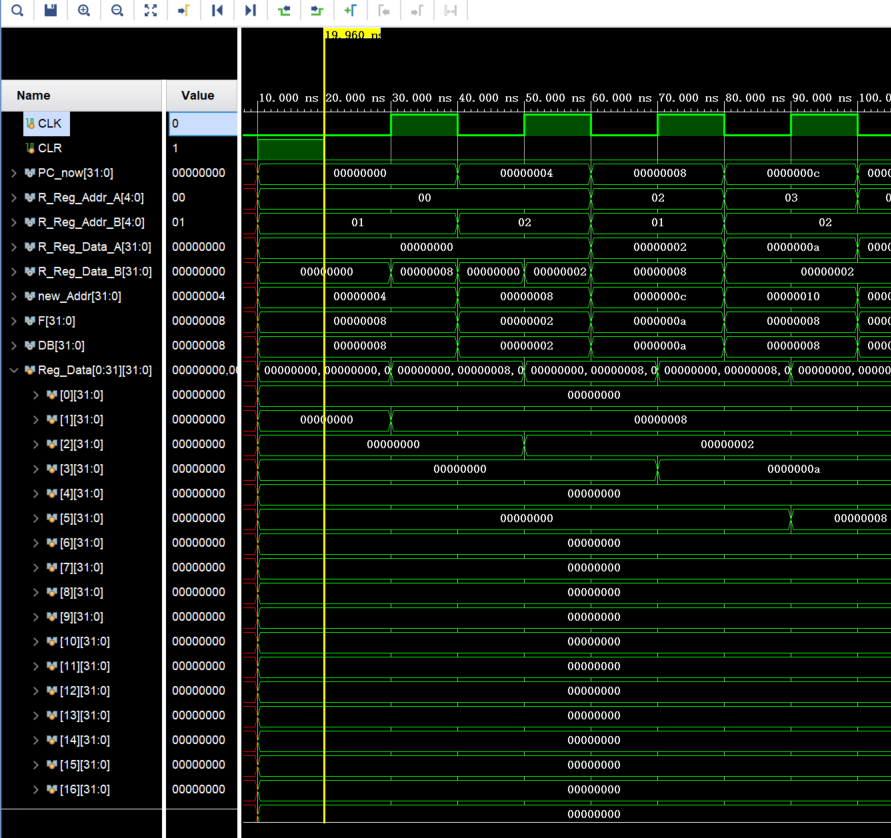

##### 指令0x00000000 addiu \$1,\$0,8

结果r1=8

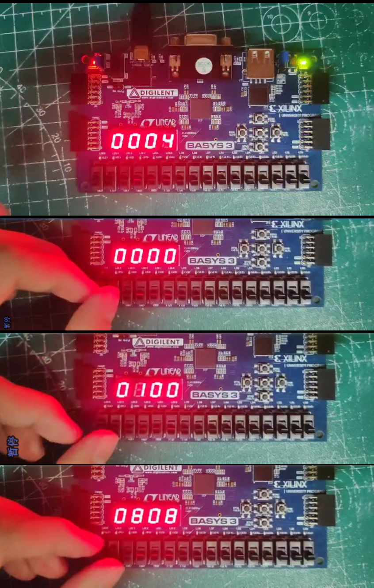

##### 指令0x00000004 ori  \$2,\$0,2

结果r2=2

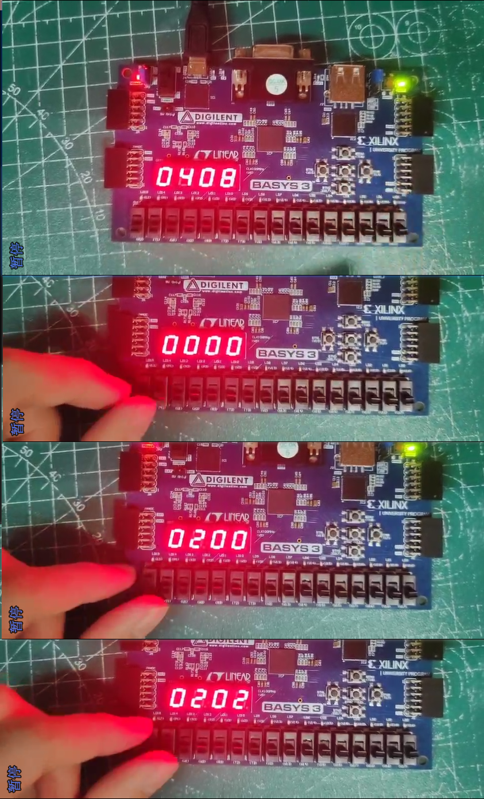

##### 指令0x00000008 add  \$3,\$2,\$1

结果r3=10

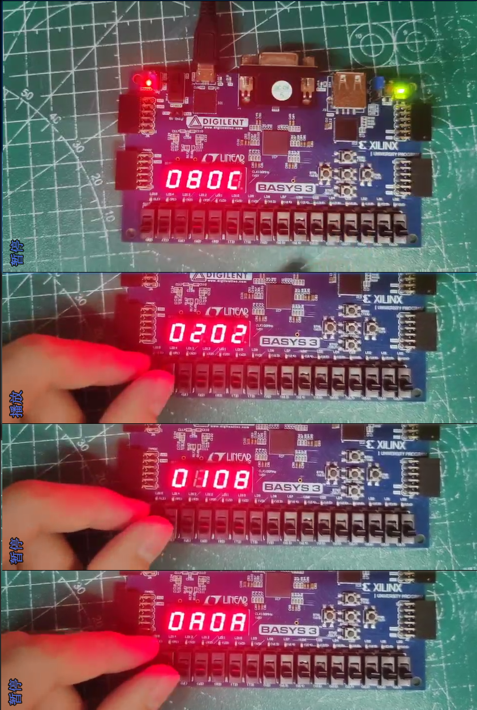


#### 0x00000018-0x0000001c指令

首先\$8=2，左移1，\$8=4，跳转了一次，之后\$8=8，不跳转

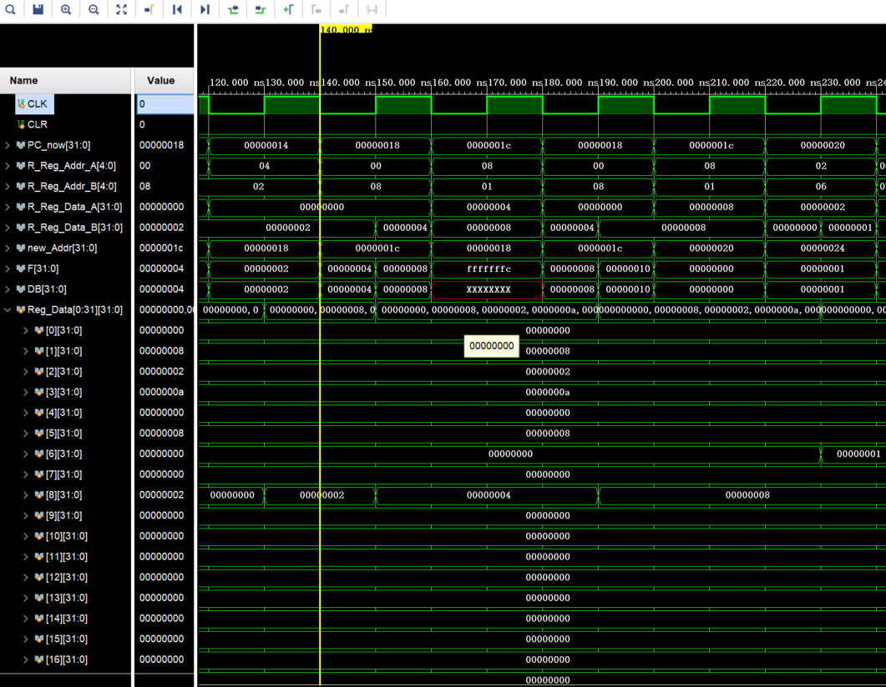


##### 指令第一个0x00000018 sll  \$8,\$8,1

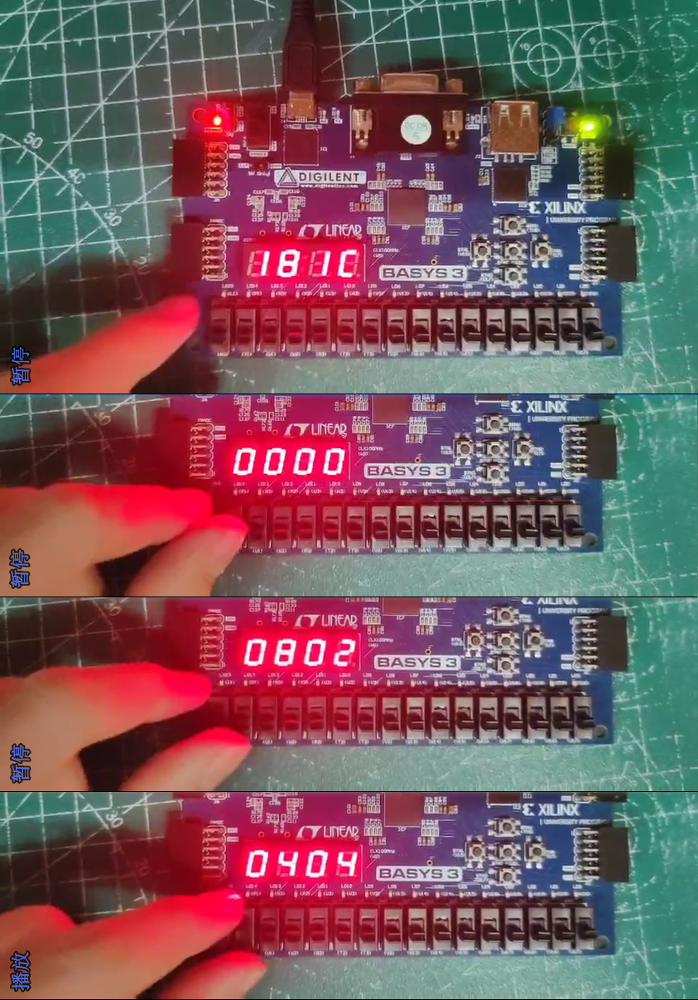


##### 两个0x0000001C bne指令


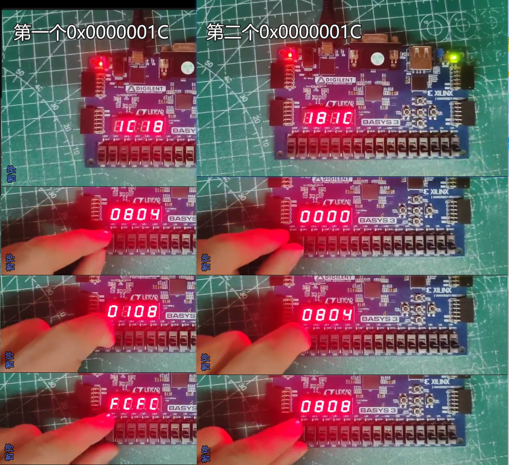

#### 指令0x00000024slti  \$7,\$6,0


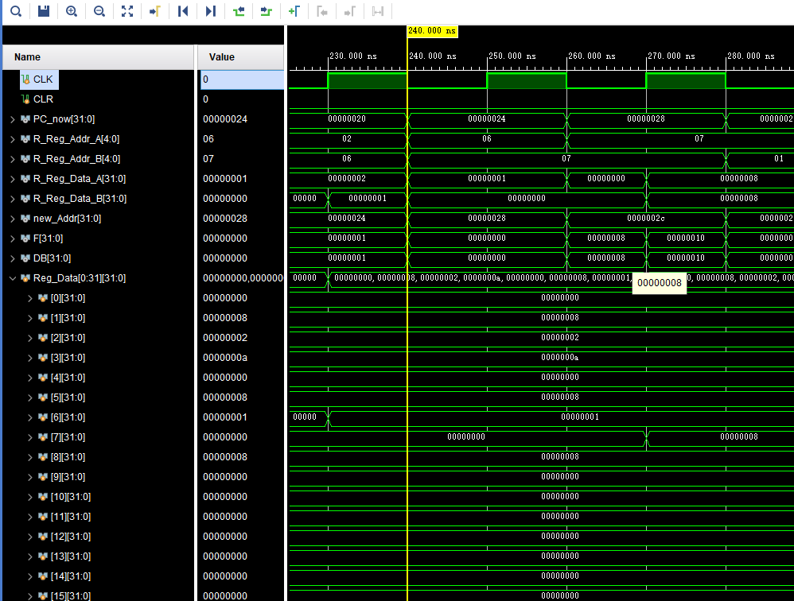

# 

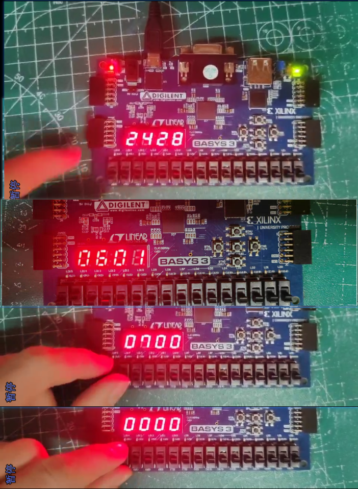

#### 指令0x00000030 sw  \$2,4(\$1)

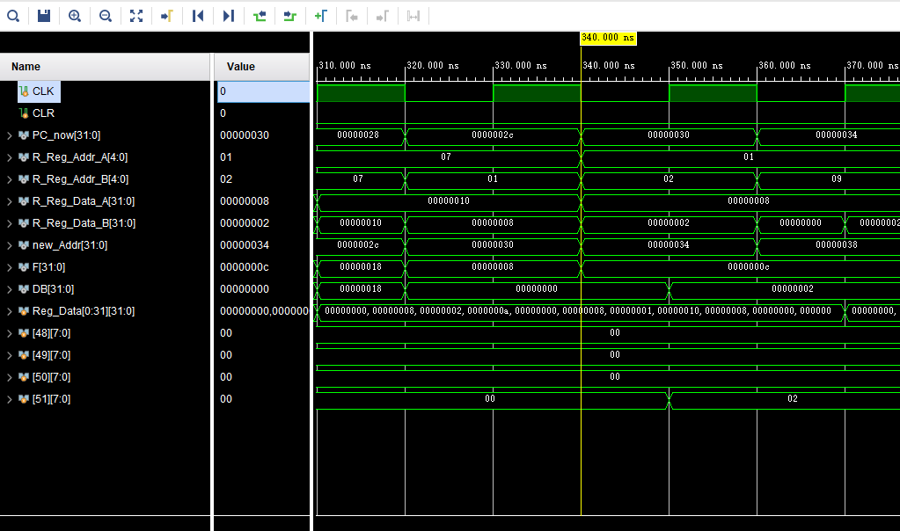


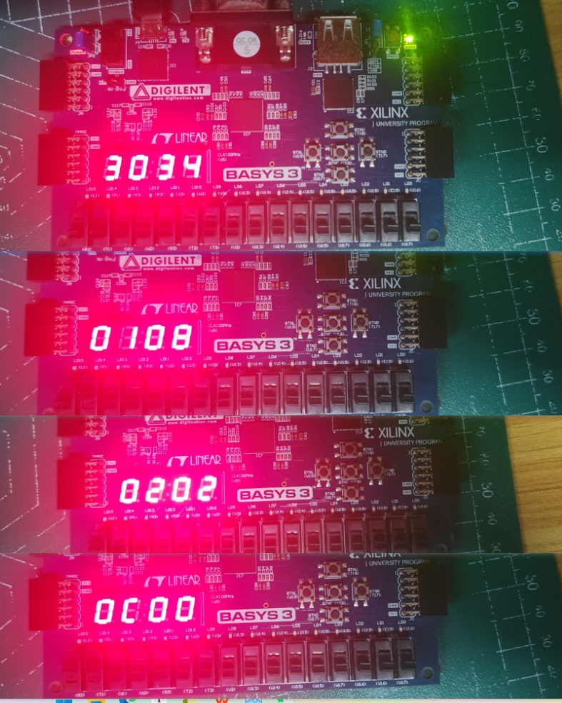


#### 指令0x00000040blez \$10,-2

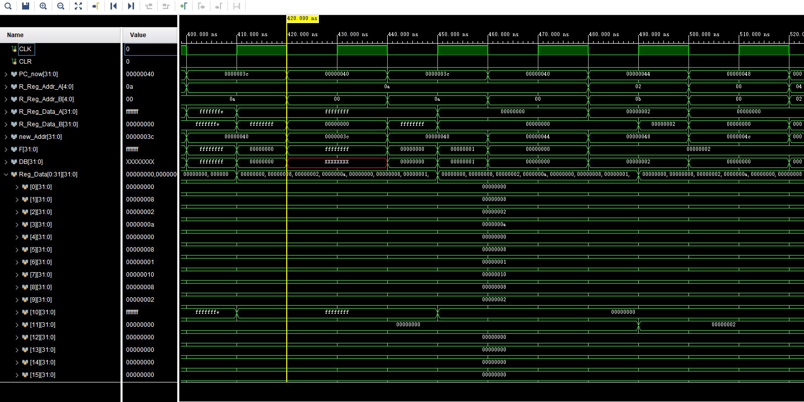

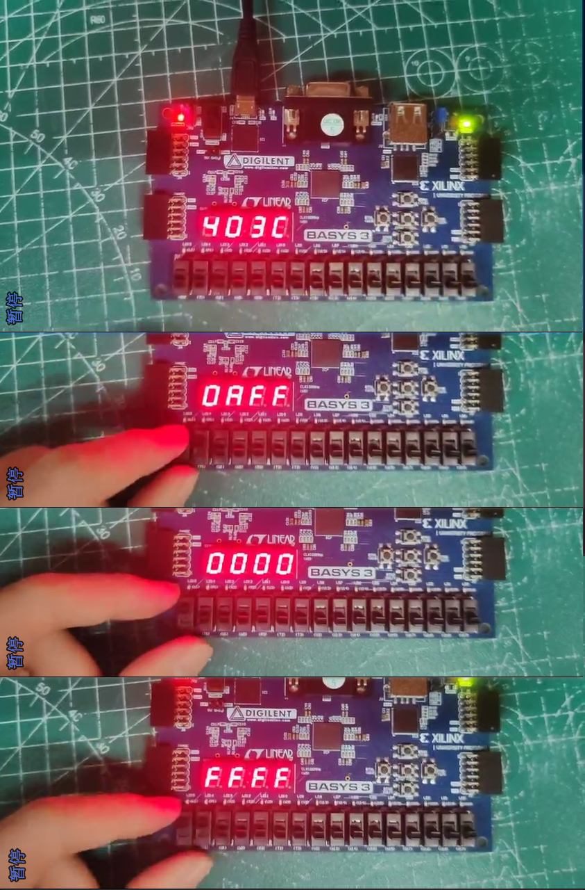

#### 指令0x00000050 halt

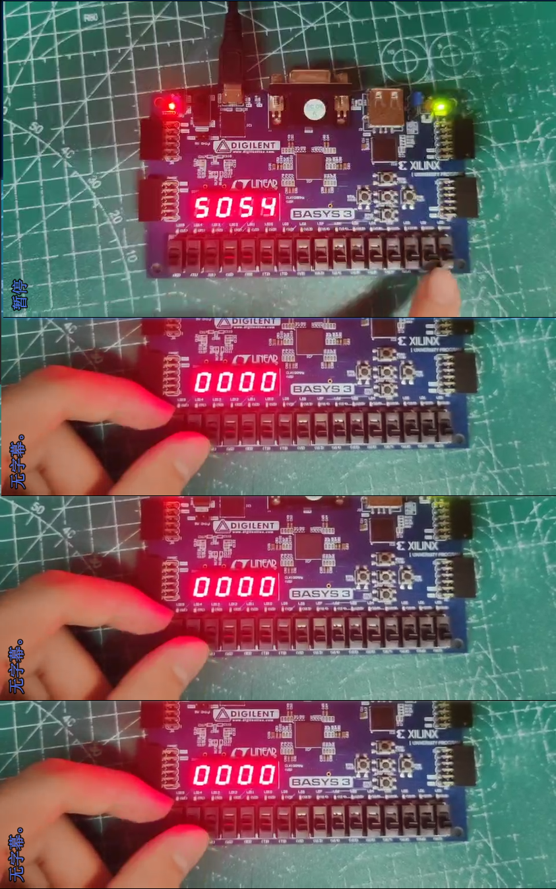

## 七、实验心得


在这次设计单周期CPU的实验中，我学到了许多许多，遇到了很多问题，但也学习了许多知识。以下是我在这次实验中遇到的⼀些重要问题，以及解决⽅法：

### 1.vivado运行仿真速度慢，错误不能及时发现，拖延做实验的时间。

针对仿真速度慢的问题，我上网搜集资料，发现vivado默认使用双线程进行仿真，且每次都从头编译。我设置了增量编译并提高线程数量，让轻薄本也能在15分钟产生bit文件。

### 2.设计的模块常常出错，不知从何处寻找错误。

针对不会排查问题的问题，我为大部分模块编写了仿真文件，通过检查每个模块的波形图，可以更加容易定位到问题出现的部分，大大缩小了排查范围。

### 3.烧写开发板经常报错，没有详细的错误信息。

针对烧写开发板报错的问题，我详细查看了报错，并将报错进行上网搜索。了解了一些常见的报错的解决方式。如果报错提示，有引脚没有接入，可能是约束文件变量名写的不一样。此时应该全部退出保存并重新编译，否则容易没有更新最新的文件。如果提示无法绑定CLK引脚，可根据提示加上语句

```verilog
set_property CLOCK_DEDICATED_ROUTE FALSE [get_nets button_CLK_IBUF]
```


### 4.代码重复输入，工作枯燥繁琐容易出错。

针对代码重复输入的问题，我使用Excel表格进行编排，更好地产生大段重复代码，以及更好地进行查找替换操作。

综上，这一次单周期CPU实验不仅让我熟悉了vivado软件的使用以及Verilog文件的编写，同时也极好地锻炼了我的排查问题能力以及耐心等待的能力。希望以后有更多的机会继续进行相关的工作与研究。
